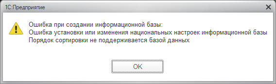
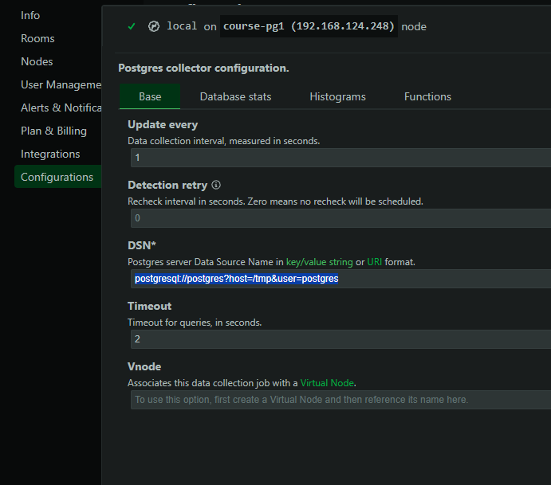

# Построение отказоустойчивого кластера на базе Patroni и PostgresPro для платформы 1С с применением Ansible

## Используемые технологии, решение проблем.

Будем использовать репо https://github.com/vitabaks/autobase/tree/master/automation 

Он в целом позволяет сделать все, что нам требуется.

Но возникает множество проблем с Postgres pro

Все настроки переменных делаем в  /home/administrator/postgres_pro_cluster/autobase/automation/group_vars/all.yml

1. Все пути к папкам другие: путь к данным, к настройкам, к бинарным файлам, к сокету

```
#postgresql_data_dir: "\
#  \
#  {{ postgresql_data_dir_mount_path | default('/pgdata') }}/{{ postgresql_version }}/{{ postgresql_cluster_name }}\
#  \
#  {{ postgresql_home_dir }}/{{ postgresql_version }}/{{ postgresql_cluster_name }}\
#  "
postgresql_data_dir: /var/lib/pgpro/1c-18/data

#postgresql_conf_dir: "\
#  \
#  /etc/postgresql/{{ postgresql_version }}/{{ postgresql_cluster_name }}\
#  \
#  {{ postgresql_data_dir }}\
#  "
postgresql_conf_dir:  "{{ postgresql_data_dir }}"

#postgresql_bin_dir: "\
#  \
#  /usr/lib/postgresql/{{ postgresql_version }}/bin\
#  \
#  /usr/pgsql-{{ postgresql_version }}/bin\
#  "
postgresql_bin_dir: "/opt/pgpro/1c-{{ postgresql_version }}/bin"

#postgresql_unix_socket_dir: "/var/run/postgresql"
postgresql_unix_socket_dir: "/tmp" #"/var/run/postgresql"

```

2. Из-за того, что сокет лежит в папке /tmp, а плейбук пытается поменять права на этой папке на нестандартные, ломается очень многое. Надо выключать блок, меняющий права

в /home/administrator/postgres_pro_cluster/autobase/automation/roles/patroni/tasks/main.yml комментируем:

```
#    - name: Prepare PostgreSQL | make sure PostgreSQL unix socket directory "{{ postgresql_unix_socket_dir | default('') }}" exists
#      ansible.builtin.file:
#        path: "{{ postgresql_unix_socket_dir }}"
#        owner: postgres
#        group: postgres
#        state: directory
#        mode: "02775"

```

3. Установка репо теперь делается только через скрипт от команды пг про. Ручное добавление ключей и репозиториев, как раньше, не работает

```
wget https://repo.postgrespro.ru/1c/1c-18/keys/pgpro-repo-add.sh
sh pgpro-repo-add.sh
```

4. права на папку /var/lib/pgpro/1c-18/data - обязательно проверить владельца postgres:postgres. Если папка есть, а права не те, ансибл это не исправит и будет ошибка

```
 chown  -R postgres:postgres /var/lib/pgpro/
```

5. Ставим русскую локаль, иначе ошибка при попытке создать базу 1С




postgresql_locale: "ru_RU.UTF-8" # for bootstrap only (initdb)

6. Добавляем параметр в initdb по рекомендациям от разработчиков специально для БД, используемых для 1с

/home/administrator/postgres_pro_cluster/autobase/automation/roles/patroni/templates/patroni.yml.j2

```
initdb:  # List options to be passed on to initdb
    - encoding: {{ postgresql_encoding }}
    - locale: {{ postgresql_locale }}
    - tune: 1c # new option
```

7. Автоматически кластер в синхронном режиме не ициализируется. 

Из-за того, что плейбук ставит patroni из пакетов и он сразу же запускается на всех нодах асинхронно, а конфиги уже готовы, происходит преждевременная инициализация кластера в ETCD. 
Далее папки данных  чистятся и стартует мастер,  ожидается запуск постгри, но он не может запуститься, т.к. в ETCD он уже не мастер, а реплика. В этот момент необходимо ручное вмешательство.
Пока плейбук ждет инициализации (там большая задержка и так есть), 

-  на всех трех нодах стопим патрони и чистим логи и папки с данными

```
systemctl stop patroni.service
rm -rf /var/log/patroni/*
rm -rf /var/log/postgresql/*
rm -rf /var/lib/pgpro/1c-18/*
```
- Удаляем на 1й ноде кластер из ETCD и затем стартуем патрони. Он запустится нормально и переинициализирует БД заново. Убеждаемся что это так.

```
patronictl -c /etc/patroni/patroni.yml remove postgres-cluster-1c

systemctl start patroni.service

patronictl -c /etc/patroni/patroni.yml  list
```
- Далее плейбук автоматически продолжит выполнение, остальная инициализация проходит нормально.
Видимо, можно это исправить на уровне логики плейбука, но автор его постоянно улучшает, не хочется уходить далеко от его проекта.


Это основные проблемы, которые возникли при адаптации плейбука.

## Создание инвентори

Перед первым запуском создаем файл инвентори, где указываем данные всех виртуальных машин

```
# if dcs_exists: false and dcs_type: "etcd"
[etcd_cluster]  # recommendation: 3, or 5-7 nodes
192.168.125.13   #course-etcd1
192.168.125.79   #course-etcd2
192.168.124.200  #course-etcd3


# if with_haproxy_load_balancing: true
[balancers]
192.168.125.13   #course-etcd1
192.168.125.79   #course-etcd2
192.168.124.200  #course-etcd3

#10.128.64.144 # balancer_tags="datacenter=dc2"
#10.128.64.145 # balancer_tags="datacenter=dc2" new_node=true

# PostgreSQL nodes
[master]
192.168.124.248  hostname=course-pg1 postgresql_exists=false

#10.128.64.140 hostname=pgnode01 postgresql_exists=false # patroni_tags="datacenter=dc1"

[replica]
192.168.124.237  hostname=course-pg2 postgresql_exists=false
192.168.124.249  hostname=course-pg3 postgresql_exists=false


[postgres_cluster:children]
master
replica


# Connection settings
[all:vars]
ansible_connection='ssh'
ansible_ssh_port='22'

```

## Инициализация кластера

Инициализируем кластер на всех нодах. Чтобы не мучаться с обновлением ансибла до последней требуемой версии,  используем докер-образ, в виде томов прокидываем инвентори и папку с ролями, где мы внесли исправления

```
docker run --rm -it \
  -e ANSIBLE_SSH_ARGS="-F none" \
  -e ANSIBLE_INVENTORY=/project/inventory \
  -v $PWD:/project \
  -v $HOME/.ssh:/root/.ssh \
  -v ./roles:/autobase/automation/roles \
  autobase/automation:2.5.2 \
    ansible-playbook deploy_pgcluster.yml  -kK

```

## Настрока бэкапов 

1. Ставим pg_probackup, настраиваем
```
pg_probackup init -B /mnt/backup_dir

sudo su postgres

psql
```
Далее выполняем команды psql
```
CREATE DATABASE backupdb;

\c backupdb

BEGIN;

CREATE ROLE backup WITH LOGIN;

GRANT USAGE ON SCHEMA pg_catalog TO backup;

GRANT EXECUTE ON FUNCTION pg_catalog.current_setting(text) TO backup;

GRANT EXECUTE ON FUNCTION pg_catalog.set_config(text, text, boolean) TO backup;

GRANT EXECUTE ON FUNCTION pg_catalog.pg_is_in_recovery() TO backup;

GRANT EXECUTE ON FUNCTION pg_catalog.pg_backup_start(text, boolean) TO backup;

GRANT EXECUTE ON FUNCTION pg_catalog.pg_backup_stop(boolean) TO backup;

GRANT EXECUTE ON FUNCTION pg_catalog.pg_create_restore_point(text) TO backup;

GRANT EXECUTE ON FUNCTION pg_catalog.pg_switch_wal() TO backup;

GRANT EXECUTE ON FUNCTION pg_catalog.pg_last_wal_replay_lsn() TO backup;

GRANT EXECUTE ON FUNCTION pg_catalog.txid_current() TO backup;

GRANT EXECUTE ON FUNCTION pg_catalog.txid_current_snapshot() TO backup;

GRANT EXECUTE ON FUNCTION pg_catalog.txid_snapshot_xmax(txid_snapshot) TO backup;

GRANT EXECUTE ON FUNCTION pg_catalog.pg_control_checkpoint() TO backup;

COMMIT;


alter user backup with password 'backup_password';
alter role backup with replication;
```

2. Правим pg_hba.conf

```
echo -e "\nhost \tbackupdb \tbackup \t\t127.0.0.1/32 \t\ttrust" >> /var/lib/pgpro/1c-18/data/pg_hba.conf

echo -e "\nhost \treplication \tall \t\t127.0.0.1/32 \t\ttrust" >> /var/lib/pgpro/1c-18/data/pg_hba.conf

tail /var/lib/pgpro/1c-18/data/pg_hba.conf

/opt/pgpro/1c-18/bin/pg_ctl -D /var/lib/pgpro/1c-18/data reload


pg_probackup  add-instance -B /mnt/backup_dir -D /var/lib/pgpro/1c-18/data --instance=course_pg
```

3. Бэкап можно делать как с ведущей, так и с ведомой ноды.
```

pg_probackup  backup -B /mnt/backup_dir -b FULL --instance=course_pg --stream --pghost=127.0.0.1 -U backup

pg_probackup show  -B /mnt/backup_dir
```


## Восстановление кластера из резервной копии

Восстановление, как и обычно в patroni, делается через инициализацию нового кластера из бэкапа

Меняем настройки в плейбуке, касающиеся pg_probackup

```
# pg_probackup
pg_probackup_install: true # or 'true'
pg_probackup_install_from_postgrespro_repo: true # or 'false'
pg_probackup_version: "{{ postgresql_version }}"
pg_probackup_instance: "course_pg"
pg_probackup_dir: "/mnt/backup_dir"
pg_probackup_threads: "4"
```

Меняем тип инициализации кластера на patroni_cluster_bootstrap_method


```
# https://patroni.readthedocs.io/en/latest/replica_bootstrap.html#bootstrap
#patroni_cluster_bootstrap_method: "initdb" # or "wal-g", "pgbackrest", "pg_probackup"
patroni_cluster_bootstrap_method: "pg_probackup" # or "wal-g", "pgbackrest", "pg_probackup"
```
Теперь удаляем старый кластер с помощью отдельного плейбука

```
docker run --rm -it \
  -e ANSIBLE_SSH_ARGS="-F none" \
  -e ANSIBLE_INVENTORY=/project/inventory \
  -v $PWD:/project \
  -v $HOME/.ssh:/root/.ssh \
  autobase/automation:2.5.2 \
    ansible-playbook remove_cluster.yml -e "remove_postgres=true remove_etcd=true" -kK
```
И делаем инициализацию заново, уже не с нуля, а из резервной копии

```
docker run --rm -it \
  -e ANSIBLE_SSH_ARGS="-F none" \
  -e ANSIBLE_INVENTORY=/project/inventory \
  -v $PWD:/project \
  -v $HOME/.ssh:/root/.ssh \
  -v ./roles:/autobase/automation/roles \
  autobase/automation:2.5.2 \
    ansible-playbook deploy_pgcluster.yml  -kK

```

В процессе инициализации используем ручной сброс настроек кластера.

## Мониторинг

Настраиваем мониторинг. По умолчанию мониторинг netdata доступен на нодах с postgres. Мониторинг самих хостов работает нормально

http://192.168.124.248:19999/

Для мониторинга postgres нужны правки. По умолчанию netdata ищет сокет, как в ванильном постгри в /var/run/postresql.
Меняем строку подключения, чтобы использовался сокет в /tmp  

postgresql://postgres?host=/tmp&user=postgres



После этого и мониторинг БД начинает работать.


## Выводы

1. Цели проекта достигнуты и все задачи выполнены.
2. Большая часть плейбука, включая балансировщик и мониторинг, работала полностью штатно. Проблемы, как и планировалось, возникли с адаптацией к PostgresPro, особенно с инициализацией синхронного кластера.
3. Проект занял суммарно около 48 часов. Большую часть заняла отладка проблем инициализации.
4. Оценка полезности проекта 9, разобран ряд важных проблем взаимодействия кластера Postgres и платформы 1С
5. Остался вопрос полностью автоматической инициализации кластера, однако требуется значительная переработка изначального плейбука.
6. Планируется тестирование проекта на реальных мощностях и оптимизация производительности кластера для реального применения.
