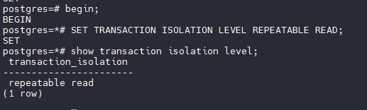

1. Создать новый проект в Яндекс облако или на любых ВМ, например postgres2024-<yyyymmdd>, где
yyyymmdd год, месяц и день вашего рождения (имя проекта должно быть уникально)
Будем использовать VM на гипервизоре Proxmox

2. Создать инстанс виртуальной машины с дефолтными параметрами - 1-2 ядра, 2-4Гб памяти, любой
линукс (на курсе Ubuntu 100%)


3. Добавить свой ssh ключ

Используем вход по паролю.

4. Зайти удаленным ssh (первая сессия)


5. Поставить PostgreSQL из пакетов apt install


6. Зайти вторым ssh (вторая сессия)


7. Запустить везде psql из под пользователя postgres


8. Выключить auto commit

В PostgreSQL, в отличие от некоторых других СУБД, режим auto commit по умолчанию отключен. 
На сервере команда выдает ошибку после версии 9.5

```
postgres=# SET AUTOCOMMIT TO OFF;
ERROR:  unrecognized configuration parameter "autocommit"
```

На клиенте 
```
\set AUTOCOMMIT off
```

9. Сделать в первой сессии новую таблицу и наполнить ее данными


10. Посмотреть текущий уровень изоляции: show transaction isolation level


11. Начать новую транзакцию в обоих сессиях с дефолтным (не меняя) уровнем изоляции


12. В первой сессии добавить новую запись


13. Посмотреть таблицу во второй сессии. Видите ли вы новую запись и если да то почему?


Мы не видим новую запись поскольку транзакция вставки не зафиксирована.

14. Завершить первую транзакцию


15. Посмотреть таблицу во второй сессии. Видите ли вы новую запись и если да то почему?
Завершить транзакцию во второй сессии.


Теперь запись видна поскольку транзакция вставки подтверждена и с этим уровнем изоляции транзакций она и должна быть видима.

16. Начать новые транзакции с repeatable read



17. В первой сессии добавить новую запись


18. Посмотреть таблицу во второй сессии. Видите ли вы новую запись и если да то почему?


Запись не видна, поскольку транзакция вставки не подтверждена.

19. Завершить первую транзакцию


20. Посмотреть таблицу во второй сессии. Видите ли вы новую запись и если да то почему?


Запись не видна, поскольку с этим уровнем изоляции должна обеспечиваться повторяемость чтения внутри транзакции.

Завершить транзакцию во второй сессии. 


После завершения транзакции запись стала видна.
Мы проверили уровни изоляции транзакций в PostgreSQL и изучили их отличия.