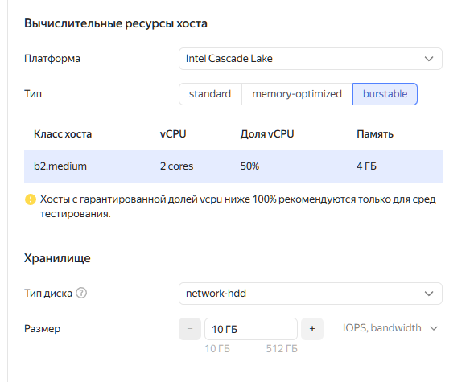

```
Развернуть managed PostgreSQL в двух облаках (на выбор: VK Cloud, Yandex Cloud, SberCloud).
```
Выбираем Яндекс и Сбер, как более адекватные. ВК на их фоне сразу выглядит крайне убого.


Настройки Яндекс, минимальная конфигурация




```
Минимальные параметры: 1 vCPU, 1 ГБ RAM
Настроить доступ с вашего IP
```

В группе доступа по умолчанию доступ есть там и там

```
Проверить подключение через psql
```

На примере Сбера. В ЯО аналогично.
```
root@vm-test2:/home/user1# psql -h 10.0.0.6 -U admin bd_7sae
Password for user admin:
psql (16.11 (Ubuntu 16.11-0ubuntu0.24.04.1), server 17.5 (Debian 17.5-1.pgdg110+1))
WARNING: psql major version 16, server major version 17.
         Some psql features might not work.
SSL connection (protocol: TLSv1.3, cipher: TLS_AES_256_GCM_SHA384, compression: off)
Type "help" for help.

bd_7sae=> \timing on
Timing is on.
bd_7sae=> select 1;
 ?column?
----------
        1
```

```
Сравнить характеристики:
Стоимость в месяц (включая резервные копии)
```

Сбер
Итого в месяц
с учетом НДС
4 631,90 ₽
Детализация заказа
Узлы  x2
Вычислительный ресурс
4 393,44 ₽
1 vCPU | 4 ГБ RAM
Диск с данными
238,46 ₽
SSD: 10 ГБ
Стоимость: 4 631,90 ₽

Яндекс
5 450,11 ₽
в месяц
Managed Service for PostgreSQL. Вычислительные ресурсы хостов, Intel Cascade Lake, 50% vCPU
2 332,80 ₽
Managed Service for PostgreSQL. Хранилище на сетевых HDD-дисках
69,12 ₽
Managed Service for PostgreSQL. Вычислительные ресурсы хостов, Intel Cascade Lake, RAM
3 048,19 ₽

Яндекс чуть дороже, и не имеет варианта 1 CPU. Вместо него выбрали 2х50%.
В Яндексе все работает, в Сбере в итоге пришлось сделать кластер без репликации, из одной ноды. Кластер с репликой падал с неизвестной ошибкой в момент создания. Не понятно почему так, тех. поддержка не помогла.

```
Latency при выполнении запросов
```

Яндекс
```
test=> \timing on
Timing is on.
test=> SELECT version();
                                                                     version
-------------------------------------------------------------------------------------------------------------------------------------------------
 PostgreSQL 17.6 (Ubuntu 17.6-201-yandex.59659.b6403fb1f5) on x86_64-pc-linux-gnu, compiled by gcc (Ubuntu 11.4.0-1ubuntu1~22.04) 11.4.0, 64-bit
(1 row)

Time: 6.731 ms
test=> SELECT version();
                                                                     version
-------------------------------------------------------------------------------------------------------------------------------------------------
 PostgreSQL 17.6 (Ubuntu 17.6-201-yandex.59659.b6403fb1f5) on x86_64-pc-linux-gnu, compiled by gcc (Ubuntu 11.4.0-1ubuntu1~22.04) 11.4.0, 64-bit
(1 row)

Time: 6.937 ms
```

Сбер
```
bd_7sae=> \timing on
Timing is on.
bd_7sae=> select 1;
 ?column?
----------
        1
(1 row)

Time: 12.280 ms
bd_7sae=> select 1;
 ?column?
----------
        1
(1 row)

Time: 4.052 ms
bd_7sae=> select 1;
 ?column?
----------
        1
(1 row)

```

Задержки в яндексе стабильнее, но в среднем выше. В сбере меньше, но бывают и долгими моментами.


Pgbench Яндекс
```
root@test2:/home/admin# /usr/bin/pgbench -h rc1b-gurq5vbelf37cojd.mdb.yandexcloud.net -p 6432 -U test  -t 1000 test
Password:
pgbench (16.11 (Ubuntu 16.11-0ubuntu0.24.04.1), server 17.6 (Ubuntu 17.6-201-yandex.59659.b6403fb1f5))
starting vacuum...end.
transaction type: <builtin: TPC-B (sort of)>
scaling factor: 400
query mode: simple
number of clients: 1
number of threads: 1
maximum number of tries: 1
number of transactions per client: 1000
number of transactions actually processed: 1000/1000
number of failed transactions: 0 (0.000%)
latency average = 77.416 ms
initial connection time = 47.885 ms
tps = 12.917171 (without initial connection time)

```
Сбер

```
root@vm-test2:/home/user1# pgbench -h 10.0.0.6 -p 5432 -U dbadmin  -t 1000 bd_7sae
Password:
pgbench (16.11 (Ubuntu 16.11-0ubuntu0.24.04.1), server 17.5 (Debian 17.5-1.pgdg110+1))
starting vacuum...end.
transaction type: <builtin: TPC-B (sort of)>
scaling factor: 400
query mode: simple
number of clients: 1
number of threads: 1
maximum number of tries: 1
number of transactions per client: 1000
number of transactions actually processed: 1000/1000
number of failed transactions: 0 (0.000%)
latency average = 25.678 ms
initial connection time = 30.671 ms
tps = 38.944245 (without initial connection time)

```
Видим, что производительность в сбере выше. Впрочем, в сбере не удалось создать реплику по неизвестным причинам.

```
Удобство управления (интерфейс, документация)
```
Интерфейс Яндекса наиболее удобен, документация достаточно подробная. Сбер чуть хуже, но все приемлемо. ВК - это какой-то позор.

```
Какие облака выбрали и почему
```
Выбрал бы Яндекс, в нем все заработало предсказуемо и без особых проблем. Скорость чуть меньше, но возможно повлияла разница в конфигурации - два проца по 50% хуже чем один, но 100%. Одинаковые параметры нельзя было выбрать. В Сбере  кластер мастер-реплика не захотел создаваться.

```
С какими проблемами столкнулись (например, сложность настройки доступа)
```

В Сбере сложнее настраивать доступность, не сразу очевидно где брать пароль кластера, не заработала реплика. 

```
Вывод: какое облако лучше подходит для BananaFlow?
```
Думаю, в общем случае Яндекс.  Возможно, для максимальной производительности лучше подйдет Сбер, но нужны тесты на реальных данных. 
