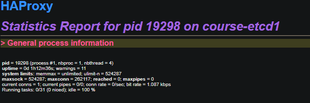
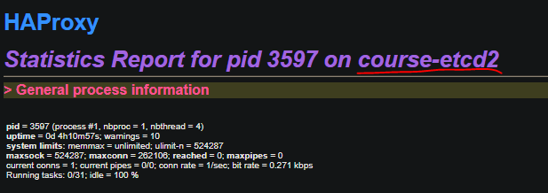

```
Вариант 1. Кластер своими руками

Разверните высокодоступный кластер PostgreSQL вручную. Возможные технологии:
```
Будем использовать кластер из HW4 -  Patroni + Etcd + HAProxy

Только добавим в него нормальную отказоустойчивость самого HAProxy с помощью keepalived

```
Среда развертывания:

Можно использовать виртуальные машины в локальной сети (например, через VirtualBox, Proxmox)
```

Кластер будем разворачивать на 6 ВМ внутри Proxmox, три под etcd, три под patroni + postgres.
На первых двух машинах также развернем haproxy + keepalived с определением падения haproxy и передачей виртуального адреса через VRRP.
 
1. Восстанавливаем наш отказуостойчивый кластер, запускаем службу патрони, удаляем папку с данными из работы про кликхаус.
Убеждаемся, что кластер работает и у нас есть две реплики. Мастер на ноде Node33.

```
root@course-pg1:/etc# patronictl -c /etc/patroni.yml list
+ Cluster: Pg_Cluster4 (7564535366681498843) ----+----+-------------+-----+------------+-----+
| Member | Host            | Role    | State     | TL | Receive LSN | Lag | Replay LSN | Lag |
+--------+-----------------+---------+-----------+----+-------------+-----+------------+-----+
| Node11 | 192.168.124.248 | Replica | streaming | 11 |  0/54000060 |   0 | 0/54000060 |   0 |
| Node22 | 192.168.124.237 | Replica | streaming | 11 |  0/54000060 |   0 | 0/54000060 |   0 |
| Node33 | 192.168.124.249 | Leader  | running   | 11 |             |     |            |     |
+--------+-----------------+---------+-----------+----+-------------+-----+------------+-----+

```
Теперь настроим отказоустойчивый балансировщик. На нодах  course-etcd1, course-etcd2 ставим пакеты haproxy, keepalived

Настраиваем  на двух нодах одинаково /etc/haproxy/haproxy.cfg 
```
listen primary
    bind *:5000
    mode tcp
    option httpchk OPTIONS /master
    option tcplog
    http-check expect status 200
    default-server inter 3s fall 3 rise 2 on-marked-down shutdown-sessions
    server node1 course-pg1:5432 maxconn 100 check port 8008
    server node2 course-pg2:5432 maxconn 100 check port 8008
    server node3 course-pg3:5432 maxconn 100 check port 8008

listen standbys
    balance roundrobin
    mode tcp
    bind *:5001
    option httpchk OPTIONS /replica
    http-check expect status 200
    default-server inter 3s fall 3 rise 2 on-marked-down shutdown-sessions
    server node1 course-pg1:5432 maxconn 100 check port 8008
    server node2 course-pg2:5432 maxconn 100 check port 8008
    server node3 course-pg3:5432 maxconn 100 check port 8008

```
Получаем порты для мастера и реплик с балансировкой - роунд-робин. Важно указывать mode tcp - иначе клиент постгри будет отваливаться сразу с ошибкой, т.к. балансировщик пытается использовать протокол HTTP.

Далее настраиваем /etc/keepalived/keepalived.conf на мастере

```
global_defs {
  router_id haproxy-server1
  enable_script_security
  script_user root
}

vrrp_script haproxy_check {
  script "/etc/keepalived/haproxy_check.sh"
  interval 2
  weight 2
}

vrrp_instance VI_1 {
    state MASTER
    interface ens18
    virtual_router_id 33
    priority 101
    advert_int 1
    unicast_src_ip 192.168.125.13

    authentication {
        auth_type PASS
        auth_pass letmein
    }

    track_script {
       haproxy_check
    }

    virtual_ipaddress {
        192.168.125.250/23 dev ens18
    }
}
```

192.168.125.250 - виртуальный адрес для VRRP

В /etc/keepalived/haproxy_check.sh записываем скрипт проверки того, что haproxy жив. Он оправляет сигнал 0 процессу балансировщика и вернет ошибку если процесс не жив.

```
#!/bin/bash
/bin/kill -0 $(cat /var/run/haproxy.pid)
```

Далее на  BACKUP


```
global_defs {
  router_id haproxy-server1
  enable_script_security
  script_user root
}

vrrp_script haproxy_check {
  script "/etc/keepalived/haproxy_check.sh"
  interval 2
  weight 2
}


vrrp_instance VI_1 {
    state BACKUP
    interface ens18
    virtual_router_id 33
    priority 100
    advert_int 1
    unicast_src_ip 192.168.125.79

    authentication {
        auth_type PASS
        auth_pass letmein
    }

 track_script {
    haproxy_check
  }

    virtual_ipaddress {
        192.168.125.250/23 dev ens18
    }
}

```

Здесь важно следить, чтобы priority во-первых указывали кто мастер, а во-вторых, при отказе проверки через track_script полученный приоритет вызывал переключение адреса.

Проверяем наш кластер, коннект на виртуальный IP

```
psql -h 192.168.125.250 -U test -p 5000 postgres
Password for user test:
psql (18.0 (Ubuntu 18.0-1.pgdg24.04+3), server 17.6 (Ubuntu 17.6-2.pgdg24.04+1))
SSL connection (protocol: TLSv1.3, cipher: TLS_AES_256_GCM_SHA384, compression: off, ALPN: postgresql)
Type "help" for help.

postgres=# \l+
                                                                                       List of databases
   Name    |  Owner   | Encoding | Locale Provider |   Collate   |    Ctype    | Locale | ICU Rules |   Access privileges   |  Size   | Tablespace |                Description
-----------+----------+----------+-----------------+-------------+-------------+--------+-----------+-----------------------+---------+------------+--------------------------------------------
 postgres  | postgres | UTF8     | libc            | en_US.UTF-8 | en_US.UTF-8 |        |           |                       | 7571 kB | pg_default | default administrative connection database
 template0 | postgres | UTF8     | libc            | en_US.UTF-8 | en_US.UTF-8 |        |           | =c/postgres          +| 7345 kB | pg_default | unmodifiable empty database
           |          |          |                 |             |             |        |           | postgres=CTc/postgres |         |            |
 template1 | postgres | UTF8     | libc            | en_US.UTF-8 | en_US.UTF-8 |        |           | =c/postgres          +| 7571 kB | pg_default | default template for new databases
           |          |          |                 |             |             |        |           | postgres=CTc/postgres |         |            |
(3 rows)

```

Роняем сначала мастер-ноду постгри sudo systemctl stop patroni на Node33

```
 patronictl -c /etc/patroni.yml list
+ Cluster: Pg_Cluster4 (7564535366681498843) ----+----+-------------+-----+------------+-----+
| Member | Host            | Role    | State     | TL | Receive LSN | Lag | Replay LSN | Lag |
+--------+-----------------+---------+-----------+----+-------------+-----+------------+-----+
| Node11 | 192.168.124.248 | Replica | streaming | 12 |  0/580001E0 |   0 | 0/580001E0 |   0 |
| Node22 | 192.168.124.237 | Leader  | running   | 12 |             |     |            |     |
| Node33 | 192.168.124.249 | Replica | stopped   |    |     unknown |     |    unknown |     |
+--------+-----------------+---------+-----------+----+-------------+-----+------------+-----+

```
На клиенте видим временный разрыв связи, но следом реконнект и базы живы

```
postgres=# \l+
SSL error: unexpected eof while reading
The connection to the server was lost. Attempting reset: Succeeded.
psql (18.0 (Ubuntu 18.0-1.pgdg24.04+3), server 17.6 (Ubuntu 17.6-2.pgdg24.04+1))
SSL connection (protocol: TLSv1.3, cipher: TLS_AES_256_GCM_SHA384, compression: off, ALPN: postgresql)
postgres=# \l+
                                                                                       List of databases
   Name    |  Owner   | Encoding | Locale Provider |   Collate   |    Ctype    | Locale | ICU Rules |   Access privileges   |  Size   | Tablespace |                Description
-----------+----------+----------+-----------------+-------------+-------------+--------+-----------+-----------------------+---------+------------+--------------------------------------------
 postgres  | postgres | UTF8     | libc            | en_US.UTF-8 | en_US.UTF-8 |        |           |                       | 7571 kB | pg_default | default administrative connection database
 template0 | postgres | UTF8     | libc            | en_US.UTF-8 | en_US.UTF-8 |        |           | =c/postgres          +| 7345 kB | pg_default | unmodifiable empty database
           |          |          |                 |             |             |        |           | postgres=CTc/postgres |         |            |
 template1 | postgres | UTF8     | libc            | en_US.UTF-8 | en_US.UTF-8 |        |           | =c/postgres          +| 7571 kB | pg_default | default template for new databases
           |          |          |                 |             |             |        |           | postgres=CTc/postgres |         |            |
(3 rows)

```
Поднимаем 3 ноду постгри и роняем хапрокси на мастере балансировщика systemctl stop  haproxy

До падения 



После падения



На клиенте видим ту же картину - коннект разрывается и тут же поднимается снова.

```
postgres=# \l+
SSL error: unexpected eof while reading
The connection to the server was lost. Attempting reset: Succeeded.
psql (18.0 (Ubuntu 18.0-1.pgdg24.04+3), server 17.6 (Ubuntu 17.6-2.pgdg24.04+1))
SSL connection (protocol: TLSv1.3, cipher: TLS_AES_256_GCM_SHA384, compression: off, ALPN: postgresql)
postgres=# \l+
                                                                                       List of databases
   Name    |  Owner   | Encoding | Locale Provider |   Collate   |    Ctype    | Locale | ICU Rules |   Access privileges   |  Size   | Tablespace |                Description
-----------+----------+----------+-----------------+-------------+-------------+--------+-----------+-----------------------+---------+------------+--------------------------------------------
 postgres  | postgres | UTF8     | libc            | en_US.UTF-8 | en_US.UTF-8 |        |           |                       | 7571 kB | pg_default | default administrative connection database
 template0 | postgres | UTF8     | libc            | en_US.UTF-8 | en_US.UTF-8 |        |           | =c/postgres          +| 7345 kB | pg_default | unmodifiable empty database
           |          |          |                 |             |             |        |           | postgres=CTc/postgres |         |            |
 template1 | postgres | UTF8     | libc            | en_US.UTF-8 | en_US.UTF-8 |        |           | =c/postgres          +| 7571 kB | pg_default | default template for new databases
           |          |          |                 |             |             |        |           | postgres=CTc/postgres |         |            |
(3 rows)

```

Запускаем haproxy на мастере и видимо что IP адрес переключился обратно.

Таким образом, мы настроили отказоустойчивость не только самого postgresql, но и балансировщика нагрузки haproxy с помощью демона keepalived, виртуального IP адреса и протокола VRRP.

