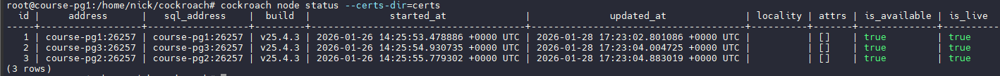
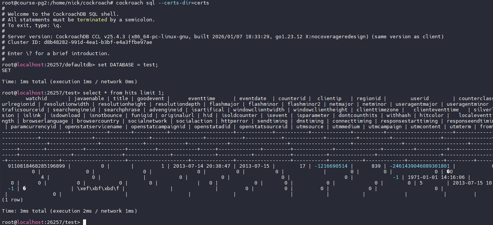

```
     Вариант 1: CockroachDB в облаке
     
Разверни CockroachDB в облаке
```
Будем использовать те же машины, что и для патрони. Останавливаем постгри и патрони, ставим CockroachDB
Оказывается, что все репо производителя ПО банят и адреса РФ и все прокси, получаем 403 Frobidden
Единственный доступный вариант получить бинарники - репо Garuda Linux

```
wget https://builds.garudalinux.org/repos/chaotic-aur/x86_64/cockroachdb-bin-25.4.3-1-x86_64.pkg.tar.zst
zstd -d  ./cockroachdb-bin-25.4.3-1-x86_64.pkg.tar.zst
```
Распакованный пакет копируем в системные пути.
Далее по инструкции

```
-- стартуем ноды
-- genere certs
mkdir certs my-safe-directory
cockroach cert create-ca --certs-dir=certs --ca-key=my-safe-directory/ca.key
-- сразу генерим сертификат на 4 ноды
cockroach cert create-node localhost course-pg1 course-pg2 course-pg3 course-pg4 --certs-dir=certs --ca-key=my-safe-directory/ca.key --overwrite
cockroach cert create-client root --certs-dir=certs --ca-key=my-safe-directory/ca.key

-- on node1
cockroach start --certs-dir=certs --advertise-addr=course-pg1 --join=course-pg1,course-pg2,course-pg3 --cache=.25 --max-sql-memory=.25 --background

-- on node2
chmod 700 certs/*
ls -l certs/
cockroach start --certs-dir=certs --advertise-addr=course-pg2 --join=course-pg1,course-pg2,course-pg3 --cache=.25 --max-sql-memory=.25 --background

-- on node 3
chmod 700 certs/*
cockroach start --certs-dir=certs --advertise-addr=course-pg3 --join=course-pg1,course-pg2,course-pg3 --cache=.25 --max-sql-memory=.25 --background

-- инициализируем кластер
cockroach init --certs-dir=certs --host=course-pg1

-- посмотрим статус кластера
cockroach node status --certs-dir=certs
```


Все работает.

```
Используй датасет 10 Гб+
```
Качаем тестовый датасет кликхауса и подрезаем до нужного размера, а то он слишком огромный

```
wget --continue --progress=dot:giga 'https://datasets.clickhouse.com/hits_compatible/hits.csv.gz' -O /tmp/hits.csv.gz
# Make data file available in "extern" directory, so it can be loaded via nodelocal
sudo mkdir -p ./extern
gzip -d -c /tmp/hits.csv.gz | sudo tee $CRDBDATADIR/extern/hits.csv > /dev/null
head -n1000000 hits.csv > trunk.csv
```
Теперь создаем БД, таблицу и делаем импорт

```
CREATE DATABASE test;

CREATE TABLE hits
(
    WatchID BIGINT NOT NULL,
    JavaEnable SMALLINT NOT NULL,
    Title TEXT NOT NULL,
    GoodEvent SMALLINT NOT NULL,
    EventTime TIMESTAMP NOT NULL,
    EventDate Date NOT NULL,
    CounterID INTEGER NOT NULL,
    ClientIP INTEGER NOT NULL,
    RegionID INTEGER NOT NULL,
    UserID BIGINT NOT NULL,
    CounterClass SMALLINT NOT NULL,
    OS SMALLINT NOT NULL,
    UserAgent SMALLINT NOT NULL,
    URL TEXT NOT NULL,
    Referer TEXT NOT NULL,
    IsRefresh SMALLINT NOT NULL,
    RefererCategoryID SMALLINT NOT NULL,
    RefererRegionID INTEGER NOT NULL,
    URLCategoryID SMALLINT NOT NULL,
    URLRegionID INTEGER NOT NULL,
    ResolutionWidth SMALLINT NOT NULL,
    ResolutionHeight SMALLINT NOT NULL,
    ResolutionDepth SMALLINT NOT NULL,
    FlashMajor SMALLINT NOT NULL,
    FlashMinor SMALLINT NOT NULL,
    FlashMinor2 TEXT NOT NULL,
    NetMajor SMALLINT NOT NULL,
    NetMinor SMALLINT NOT NULL,
    UserAgentMajor SMALLINT NOT NULL,
    UserAgentMinor VARCHAR(255) NOT NULL,
    CookieEnable SMALLINT NOT NULL,
    JavascriptEnable SMALLINT NOT NULL,
    IsMobile SMALLINT NOT NULL,
    MobilePhone SMALLINT NOT NULL,
    MobilePhoneModel TEXT NOT NULL,
    Params TEXT NOT NULL,
    IPNetworkID INTEGER NOT NULL,
    TraficSourceID SMALLINT NOT NULL,
    SearchEngineID SMALLINT NOT NULL,
    SearchPhrase TEXT NOT NULL,
    AdvEngineID SMALLINT NOT NULL,
    IsArtifical SMALLINT NOT NULL,
    WindowClientWidth SMALLINT NOT NULL,
    WindowClientHeight SMALLINT NOT NULL,
    ClientTimeZone SMALLINT NOT NULL,
    ClientEventTime TIMESTAMP NOT NULL,
    SilverlightVersion1 SMALLINT NOT NULL,
    SilverlightVersion2 SMALLINT NOT NULL,
    SilverlightVersion3 INTEGER NOT NULL,
    SilverlightVersion4 SMALLINT NOT NULL,
    PageCharset TEXT NOT NULL,
    CodeVersion INTEGER NOT NULL,
    IsLink SMALLINT NOT NULL,
    IsDownload SMALLINT NOT NULL,
    IsNotBounce SMALLINT NOT NULL,
    FUniqID BIGINT NOT NULL,
    OriginalURL TEXT NOT NULL,
    HID INTEGER NOT NULL,
    IsOldCounter SMALLINT NOT NULL,
    IsEvent SMALLINT NOT NULL,
    IsParameter SMALLINT NOT NULL,
    DontCountHits SMALLINT NOT NULL,
    WithHash SMALLINT NOT NULL,
    HitColor CHAR NOT NULL,
    LocalEventTime TIMESTAMP NOT NULL,
    Age SMALLINT NOT NULL,
    Sex SMALLINT NOT NULL,
    Income SMALLINT NOT NULL,
    Interests SMALLINT NOT NULL,
    Robotness SMALLINT NOT NULL,
    RemoteIP INTEGER NOT NULL,
    WindowName INTEGER NOT NULL,
    OpenerName INTEGER NOT NULL,
    HistoryLength SMALLINT NOT NULL,
    BrowserLanguage TEXT NOT NULL,
    BrowserCountry TEXT NOT NULL,
    SocialNetwork TEXT NOT NULL,
    SocialAction TEXT NOT NULL,
    HTTPError SMALLINT NOT NULL,
    SendTiming INTEGER NOT NULL,
    DNSTiming INTEGER NOT NULL,
    ConnectTiming INTEGER NOT NULL,
    ResponseStartTiming INTEGER NOT NULL,
    ResponseEndTiming INTEGER NOT NULL,
    FetchTiming INTEGER NOT NULL,
    SocialSourceNetworkID SMALLINT NOT NULL,
    SocialSourcePage TEXT NOT NULL,
    ParamPrice BIGINT NOT NULL,
    ParamOrderID TEXT NOT NULL,
    ParamCurrency TEXT NOT NULL,
    ParamCurrencyID SMALLINT NOT NULL,
    OpenstatServiceName TEXT NOT NULL,
    OpenstatCampaignID TEXT NOT NULL,
    OpenstatAdID TEXT NOT NULL,
    OpenstatSourceID TEXT NOT NULL,
    UTMSource TEXT NOT NULL,
    UTMMedium TEXT NOT NULL,
    UTMCampaign TEXT NOT NULL,
    UTMContent TEXT NOT NULL,
    UTMTerm TEXT NOT NULL,
    FromTag TEXT NOT NULL,
    HasGCLID SMALLINT NOT NULL,
    RefererHash BIGINT NOT NULL,
    URLHash BIGINT NOT NULL,
    CLID INTEGER NOT NULL
);


IMPORT INTO hits(WatchID, JavaEnable, Title, GoodEvent, EventTime, EventDate, CounterID, ClientIP, RegionID, UserID, CounterClass, OS, UserAgent, URL, Referer, IsRefresh, RefererCategoryID, RefererRegionID, URLCategoryID, URLRegionID, ResolutionWidth, ResolutionHeight, ResolutionDepth, FlashMajor, FlashMinor, FlashMinor2, NetMajor, NetMinor, UserAgentMajor, UserAgentMinor, CookieEnable, JavascriptEnable, IsMobile, MobilePhone, MobilePhoneModel, Params, IPNetworkID, TraficSourceID, SearchEngineID, SearchPhrase, AdvEngineID, IsArtifical, WindowClientWidth, WindowClientHeight, ClientTimeZone, ClientEventTime, SilverlightVersion1, SilverlightVersion2, SilverlightVersion3, SilverlightVersion4, PageCharset, CodeVersion, IsLink, IsDownload, IsNotBounce, FUniqID, OriginalURL, HID, IsOldCounter, IsEvent, IsParameter, DontCountHits, WithHash, HitColor, LocalEventTime, Age, Sex, Income, Interests, Robotness, RemoteIP, WindowName, OpenerName, HistoryLength, BrowserLanguage, BrowserCountry, SocialNetwork, SocialAction, HTTPError, SendTiming, DNSTiming, ConnectTiming, ResponseStartTiming, ResponseEndTiming, FetchTiming, SocialSourceNetworkID, SocialSourcePage, ParamPrice, ParamOrderID, ParamCurrency, ParamCurrencyID, OpenstatServiceName, OpenstatCampaignID, OpenstatAdID, OpenstatSourceID, UTMSource, UTMMedium, UTMCampaign, UTMContent, UTMTerm, FromTag, HasGCLID, RefererHash, URLHash, CLID) CSV DATA ('nodelocal://1/trunk.csv') ;
```

Смотрим данные с соседней ноды:



Все ок.

```
Сравни производительность запросов с однопользовательским инстансом PostgreSQL

```
SELECT COUNT(DISTINCT UserID) FROM hits;
  count
---------
  79842
(1 row)

Time: 8.817s total (execution 8.795s / network 0.022s)

SELECT AVG(UserID) FROM hits;
           avg
-------------------------
  1948165676197850120.6
(1 row)

Time: 29.032s total (execution 29.031s / network 0.001s)

SELECT COUNT(*) FROM hits WHERE AdvEngineID <> 0;
  count
---------
  14174
(1 row)

Time: 7.003s total (execution 7.003s / network 0.001s)

SELECT SUM(AdvEngineID), COUNT(*), AVG(ResolutionWidth) FROM hits;
   sum  | count  |          avg
--------+--------+------------------------
  80778 | 999977 | 1604.0888100426309805
(1 row)

Time: 5.114s total (execution 5.098s / network 0.016s)
```
Видим, что результаты превосходят единичный постгри из работы HW9, но не дотягивают до кликхауса. Результаты ожидаемые. Тестовые запросы в основном ориентированы на преимущества клика.

```
Опиши процесс, решения и возникшие сложности
```
Основной сложностью было найти не заблокированные бинарники CockroachDB и правильно выполнить импорт. Кластер собирается по инструкции относительно легко, даже с сертификатами.