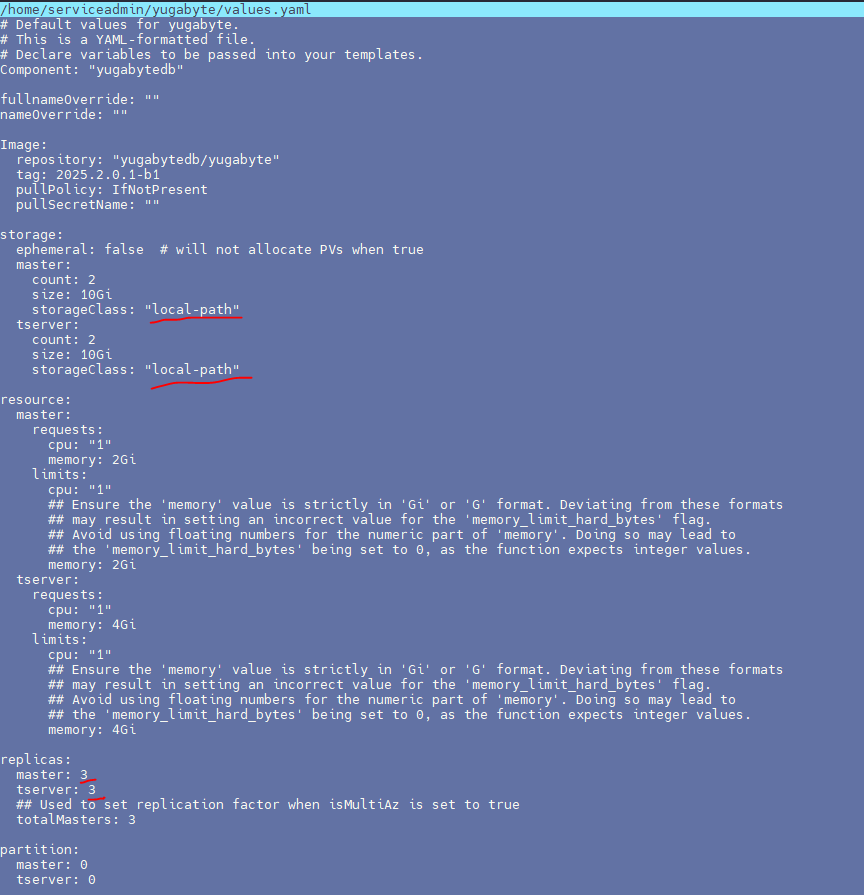
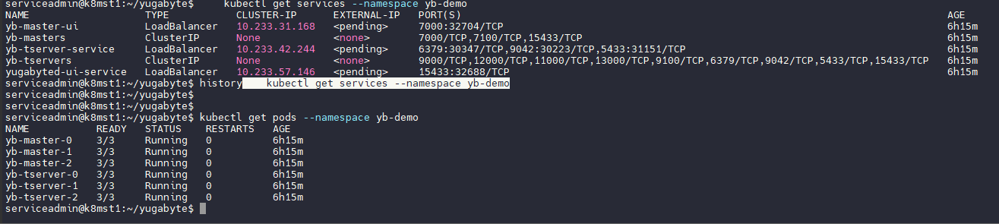
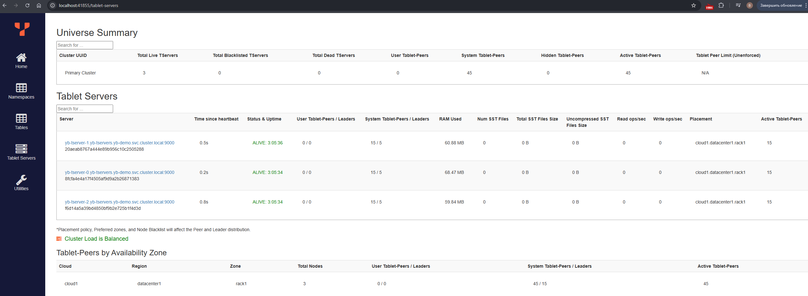

```
Разверните Yugabyte или Greenplum в Kubernetes или облаках.
```
Будем использовать свой тестовый кубернет.
Ставим через helm по инструкции. 

```
helm pull yugabytedb/yugabyte
```
распаковываем и редактируем values.yaml

Важно поправить storageClass, чтобы создались тома через провижионер, который мы поставили в предыдущих домашних работах. Создавать тома руками не хочется!



Количество реплик оставляем как есть.

Делаем инсталл, устраняем проблемы с нехваткой ресурсов, удаляя прошлую лабу.

```
kubectl create namespace yb-demo
helm install yb-demo ./ --version 2025.2.0 --namespace yb-demo --wait
kubectl get services --namespace yb-demo
```



Все поднялось, сервисы есть. Можно пробросить порт через Lens и посмотреть на веб-фейс



```
Загрузите датасет 10 Гб+ .
```
Используем тот же файл что и в прошлой лабе. 

```
kubectl exec -n yb-demo -it yb-tserver-0 -- bash
curl --output ./trunk.tsv http://192.168.124.248:8000/trunk.tsv

kubectl exec -n yb-demo -it yb-tserver-0 -- ysqlsh -h yb-tserver-0.yb-tservers.yb-demo

yugabyte=# CREATE DATABASE test;

CREATE DATABASE
yugabyte=#
yugabyte=# ALTER DATABASE test SET temp_file_limit=-1;
ALTER DATABASE

yugabyte=# \c test
You are now connected to database "test" as user "yugabyte".
test=# CREATE TABLE hits
test-# (
test(#     WatchID BIGINT NOT NULL,
test(#     JavaEnable SMALLINT NOT NULL,
test(#     Title TEXT NOT NULL,
test(#     GoodEvent SMALLINT NOT NULL,
test(#     EventTime TIMESTAMP NOT NULL,
test(#     EventDate Date NOT NULL,
test(#     CounterID INTEGER NOT NULL,
test(#     ClientIP INTEGER NOT NULL,
test(#     RegionID INTEGER NOT NULL,
test(#     UserID BIGINT NOT NULL,
test(#     CounterClass SMALLINT NOT NULL,
test(#     OS SMALLINT NOT NULL,
test(#     UserAgent SMALLINT NOT NULL,
test(#     URL TEXT NOT NULL,
test(#     Referer TEXT NOT NULL,
test(#     IsRefresh SMALLINT NOT NULL,
test(#     RefererCategoryID SMALLINT NOT NULL,
test(#     RefererRegionID INTEGER NOT NULL,
test(#     URLCategoryID SMALLINT NOT NULL,
test(#     URLRegionID INTEGER NOT NULL,
test(#     ResolutionWidth SMALLINT NOT NULL,
test(#     ResolutionHeight SMALLINT NOT NULL,
test(#     ResolutionDepth SMALLINT NOT NULL,
test(#     FlashMajor SMALLINT NOT NULL,
test(#     FlashMinor SMALLINT NOT NULL,
test(#     FlashMinor2 TEXT NOT NULL,
test(#     NetMajor SMALLINT NOT NULL,
test(#     NetMinor SMALLINT NOT NULL,
test(#     UserAgentMajor SMALLINT NOT NULL,
test(#     UserAgentMinor VARCHAR(255) NOT NULL,
test(#     CookieEnable SMALLINT NOT NULL,
test(#     JavascriptEnable SMALLINT NOT NULL,
test(#     IsMobile SMALLINT NOT NULL,
test(#     MobilePhone SMALLINT NOT NULL,
test(#     MobilePhoneModel TEXT NOT NULL,
test(#     Params TEXT NOT NULL,
test(#     IPNetworkID INTEGER NOT NULL,
test(#     TraficSourceID SMALLINT NOT NULL,
test(#     SearchEngineID SMALLINT NOT NULL,
test(#     SearchPhrase TEXT NOT NULL,
test(#     AdvEngineID SMALLINT NOT NULL,
test(#     IsArtifical SMALLINT NOT NULL,
test(#     WindowClientWidth SMALLINT NOT NULL,
test(#     WindowClientHeight SMALLINT NOT NULL,
test(#     ClientTimeZone SMALLINT NOT NULL,
test(#     ClientEventTime TIMESTAMP NOT NULL,
test(#     SilverlightVersion1 SMALLINT NOT NULL,
test(#     SilverlightVersion2 SMALLINT NOT NULL,
test(#     SilverlightVersion3 INTEGER NOT NULL,
test(#     SilverlightVersion4 SMALLINT NOT NULL,
test(#     PageCharset TEXT NOT NULL,
test(#     CodeVersion INTEGER NOT NULL,
test(#     IsLink SMALLINT NOT NULL,
test(#     IsDownload SMALLINT NOT NULL,
test(#     IsNotBounce SMALLINT NOT NULL,
test(#     FUniqID BIGINT NOT NULL,
test(#     OriginalURL TEXT NOT NULL,
test(#     HID INTEGER NOT NULL,
test(#     IsOldCounter SMALLINT NOT NULL,
test(#     IsEvent SMALLINT NOT NULL,
test(#     IsParameter SMALLINT NOT NULL,
test(#     DontCountHits SMALLINT NOT NULL,
test(#     WithHash SMALLINT NOT NULL,
test(#     HitColor CHAR NOT NULL,
test(#     LocalEventTime TIMESTAMP NOT NULL,
test(#     Age SMALLINT NOT NULL,
test(#     Sex SMALLINT NOT NULL,
test(#     Income SMALLINT NOT NULL,
test(#     Interests SMALLINT NOT NULL,
test(#     Robotness SMALLINT NOT NULL,
test(#     RemoteIP INTEGER NOT NULL,
test(#     WindowName INTEGER NOT NULL,
test(#     OpenerName INTEGER NOT NULL,
test(#     HistoryLength SMALLINT NOT NULL,
test(#     BrowserLanguage TEXT NOT NULL,
test(#     BrowserCountry TEXT NOT NULL,
test(#     SocialNetwork TEXT NOT NULL,
test(#     SocialAction TEXT NOT NULL,
test(#     HTTPError SMALLINT NOT NULL,
test(#     SendTiming INTEGER NOT NULL,
test(#     DNSTiming INTEGER NOT NULL,
test(#     ConnectTiming INTEGER NOT NULL,
test(#     ResponseStartTiming INTEGER NOT NULL,
test(#     ResponseEndTiming INTEGER NOT NULL,
test(#     FetchTiming INTEGER NOT NULL,
test(#     SocialSourceNetworkID SMALLINT NOT NULL,
test(#     SocialSourcePage TEXT NOT NULL,
test(#     ParamPrice BIGINT NOT NULL,
test(#     ParamOrderID TEXT NOT NULL,
test(#     ParamCurrency TEXT NOT NULL,
test(#     ParamCurrencyID SMALLINT NOT NULL,
test(#     OpenstatServiceName TEXT NOT NULL,
test(#     OpenstatCampaignID TEXT NOT NULL,
test(#     OpenstatAdID TEXT NOT NULL,
test(#     OpenstatSourceID TEXT NOT NULL,
test(#     UTMSource TEXT NOT NULL,
test(#     UTMMedium TEXT NOT NULL,
test(#     UTMCampaign TEXT NOT NULL,
test(#     UTMContent TEXT NOT NULL,
test(#     UTMTerm TEXT NOT NULL,
test(#     FromTag TEXT NOT NULL,
test(#     HasGCLID SMALLINT NOT NULL,
test(#     RefererHash BIGINT NOT NULL,
test(#     URLHash BIGINT NOT NULL,
test(#     CLID INTEGER NOT NULL
test(# );
CREATE TABLE
test=#
test=# \copy hits FROM 'trunk.tsv';
COPY 1000000
test=#
```
Данные загружены с помощью команды copy

```
Проведите тест скорости запросов в сравнении с одиночным инстансом PostgreSQL.
```

Запросы используем те же что и в прошлой лабораторной.

```
SELECT COUNT(DISTINCT UserID) FROM hits;
 count
-------
 79842
(1 row)

Time: 1095.992 ms (00:01.096)

SELECT AVG(UserID) FROM hits;
         avg
---------------------
 1948194877894919562
(1 row)

Time: 798.809 ms


SELECT COUNT(*) FROM hits WHERE AdvEngineID <> 0;
 count
-------
 14174
(1 row)

Time: 390.088 ms

 SELECT SUM(AdvEngineID), COUNT(*), AVG(ResolutionWidth) FROM hits;
  sum  |  count  |          avg
-------+---------+-----------------------
 80778 | 1000000 | 1604.0895900000000000
(1 row)

Time: 372.515 ms
```

Видим результаты, значительно превосходящие PostgreSQL и практически аналогичные ClickHouse


```
Опишите процесс развертывания, настройки, проблемы и результаты.
```

Развертывание в кубернет прошло полностью по инструкции, особых проблем не возникло. Настройки были оставлены по умолчанию, кроме самых необходимых для автоматического разхвертывания.
Результаты показали достаточно высокую скорость выполнения запросов, в том числе тех, что рассчитаны на колоночное хранение. Видимо, это обусловлено схожей моделью хранения данных.

Справка 

ClickHouse® uses the MergeTree family of storage engines. Data is written in parts that are continuously merged in the background. This design favors batch inserts and append-only workloads, making it fast for ingesting millions of rows at once but slower for frequent updates to individual rows.

YugabyteDB uses a Log-Structured Merge (LSM) tree with its DocDB storage layer. LSM trees handle both reads and writes efficiently for transactional workloads, though they require periodic compaction to maintain performance as data accumulates.

