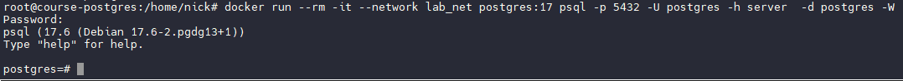

1. Создайте инстанс с Ubuntu 20.04 в Яндекс.Облаке или аналогах.

Будем использовать VM на гипервизоре Proxmox

2. Установите Docker Engine.

Используем стандартную инструкцию для Ubuntu с оф. сайта Докера

3. Создайте каталог /var/lib/postgres для хранения данных.

4. Разверните контейнер с PostgreSQL 14, смонтировав в него /var/lib/postgres.

Используем более современный Postgres 17. 

Создаем сеть, т.к. в дефолтной сети bridge резолв имен контейнеров не работает. Далее создаем контейнер в своей сети и указываем имя хоста

5. Разверните контейнер с клиентом PostgreSQL.

Создаем клиента в той же сети

6. Подключитесь из контейнера с клиентом к контейнеру с сервером и создайте таблицу с данными о перевозках.

create table shipments(id serial, product_name text, quantity int, destination text);

insert into shipments(product_name, quantity, destination) values('bananas', 1000, 'Europe');
insert into shipments(product_name, quantity, destination) values('bananas', 1500, 'Asia');
insert into shipments(product_name, quantity, destination) values('bananas', 2000, 'Africa');
insert into shipments(product_name, quantity, destination) values('coffee', 500, 'USA');
insert into shipments(product_name, quantity, destination) values('coffee', 700, 'Canada');
insert into shipments(product_name, quantity, destination) values('coffee', 300, 'Japan');
insert into shipments(product_name, quantity, destination) values('sugar', 1000, 'Europe');
insert into shipments(product_name, quantity, destination) values('sugar', 800, 'Asia');
insert into shipments(product_name, quantity, destination) values('sugar', 600, 'Africa');
insert into shipments(product_name, quantity, destination) values('sugar', 400, 'USA');

7. Подключитесь к контейнеру с сервером с ноутбука или компьютера.

8. Удалите контейнер с сервером и создайте его заново.

9. Проверьте, что данные остались на месте.

Вывод: Мы научились устанавливать докер, создавать виртуальные сети докера, запускать postgres в контейнерах и осуществлять сетевое взаимодействие между сервером и клиентом в виртуальной сети. А также освоили технологию проброса папки из хоста в контейнер volumes