Повторите шаги Алексея:

1. Создайте виртуальную машину с Ubuntu 20.04 и установите PostgreSQL 15 или выше.

Используем ВМ из домашнего задания 1.

Остновим контейнер из задания 2, чтобы не занимал порт, и запустим службу 

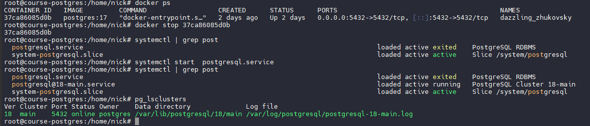

2. Создайте таблицу с данными о перевозках.

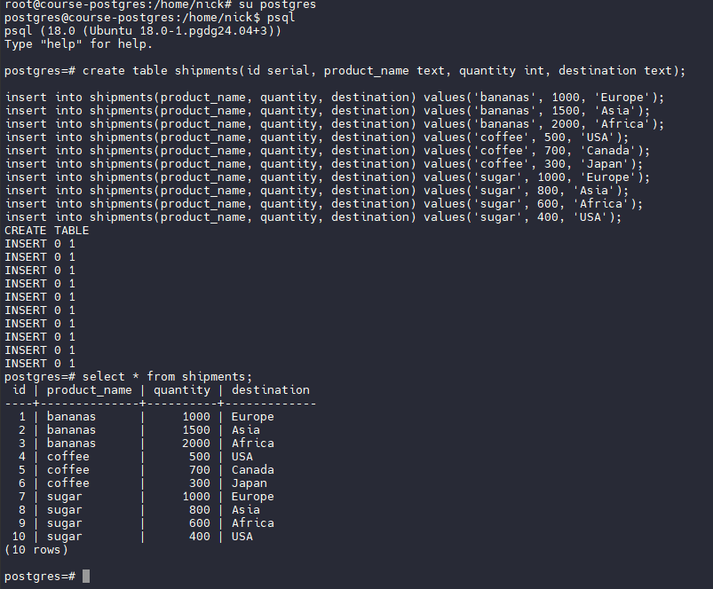

Данные в таблице.

3. Добавьте внешний диск к виртуальной машине и перенесите туда базу данных.

Смотрим существующие диски и свободное место

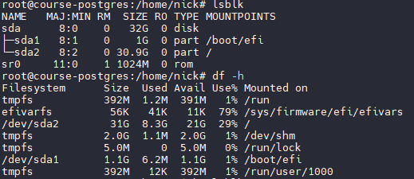

Добавляем диск

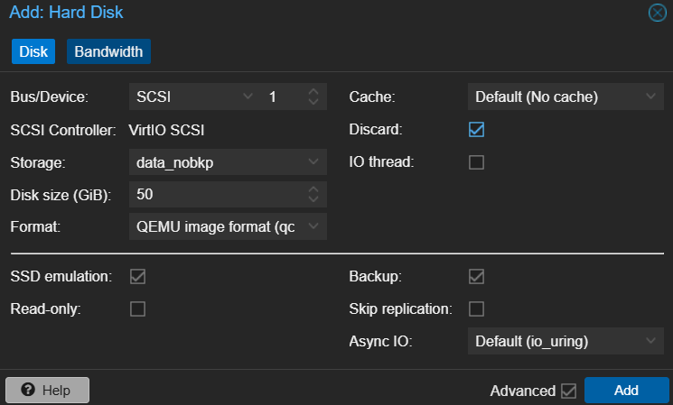

Смотрим новое имя диска

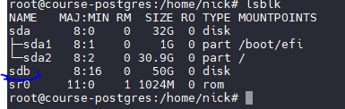

Создаем раздел

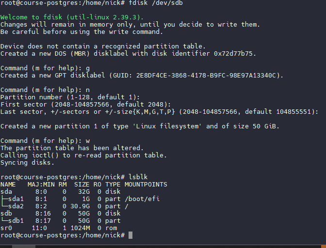

Создаем ФС и смотрим UID 

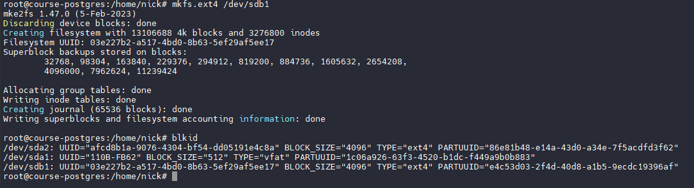

Вписываем в fstab через mcedit /etc/fstab

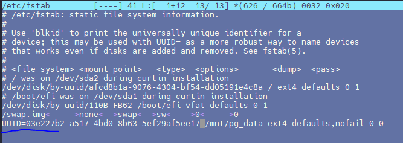

Создаем каталог, монтируем, рестартим systemd, проверяем

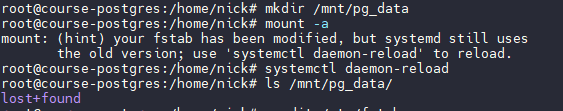

4. Настройте PostgreSQL для работы с новым диском.

Останавливаем кластер, перемещаем папку с данными на новый диск, проверяем что права и владелец перенеслись. Это важно, иначе постгри не запустится

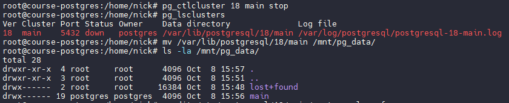

Запускаем кластер и проверяем

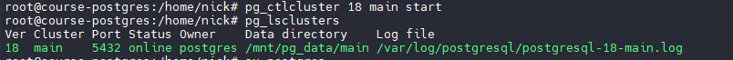

5. Проверьте, что данные сохранились и доступны.

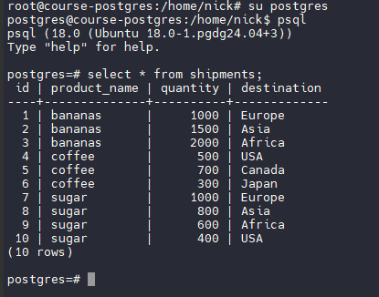

Данные на месте.

Выводы: 
1. Мы научились подключать новый диск к виртуальной машине, создавать раздел, файловую систему, монтировать раздел 
2. Перенесли данные постгри, поменяли настройки в файле конфигурации, научились останавливать и запускать постгри как через системную команду systemctl так и через его собственную.
3. Убедились в правильности процедуры переноса данных на новый том.