Повторите шаги Алексея:

1. Создайте 3 виртуальные машины для etcd и 3 виртуальные машины для Patroni.

Создаем из машины для ДЗ 1 шаблон, а из него 6 машин, переименовываем, меняем machine id, чтобы получить уникальные адреса по DHCP


2. Разверните HA-кластер PostgreSQL с использованием Patroni.

Ставим etcd на course-etcd1-3

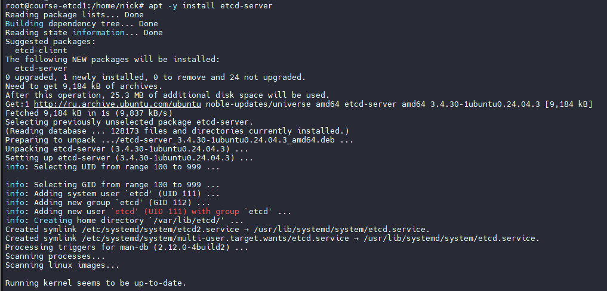

Редактируем /etc/hosts чтобы использовать имена машин

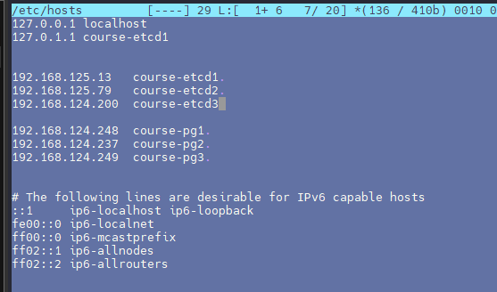

Редактируем конфиги mcedit /etc/default/etcd

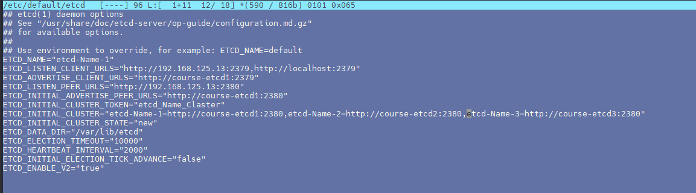

Запускаем etcd и смотрим статус, видим лидера

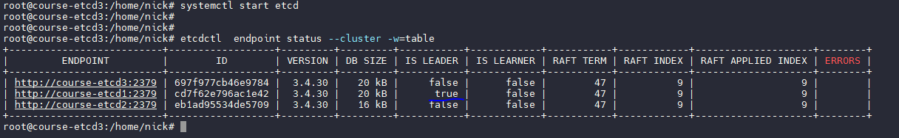

Далее будем ставить Патрони. Ставим все зависимости и сам патрони

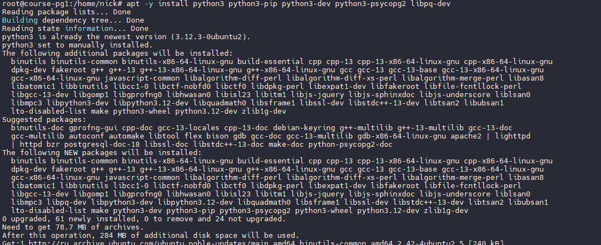

Правим конфиги mcedit /etc/patroni.yml

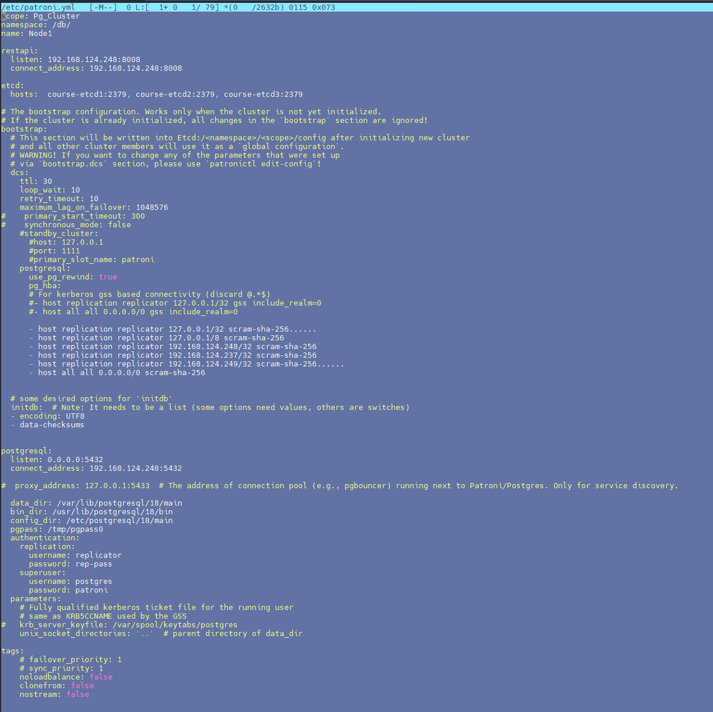

Стартуем и смотрим статус

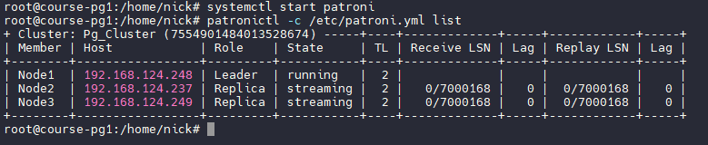

3. Настройте HAProxy для балансировки нагрузки.

Ставим HAProxy для примера на course-etcd1

```
apt-get install --no-install-recommends software-properties-common
add-apt-repository ppa:vbernat/haproxy-3.2
apt-get install haproxy=3.2.\*
```
Редактируем конфиг mcedit 
/etc/haproxy/haproxy.cfg

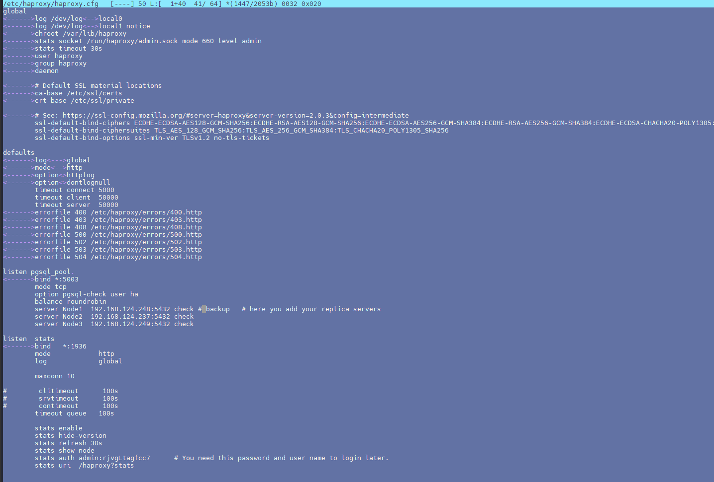

запускаемся и смотрим статус

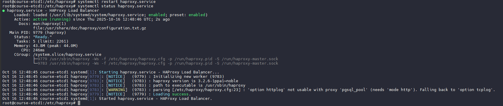

Смотрим веб-панель HAproxy

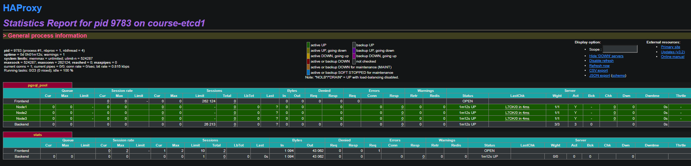

4. Проверьте отказоустойчивость кластера, имитируя сбой на одном из узлов.

Открываем коннект через HAProxy на порту 5003, смотрим доступность баз

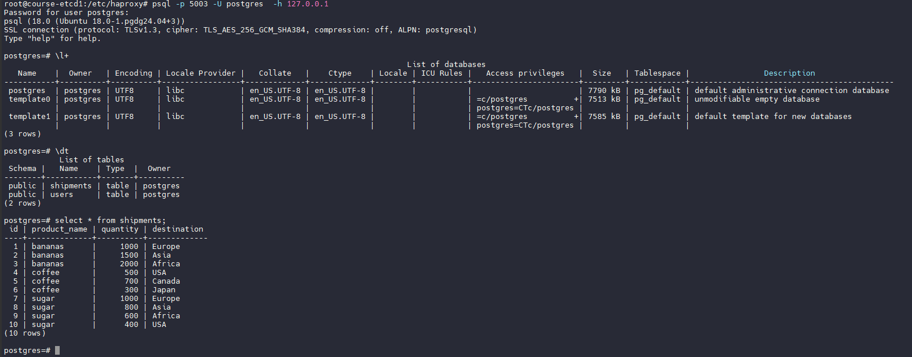

Роняем первую ноду с мастером патрони, лидером становится 3я нода

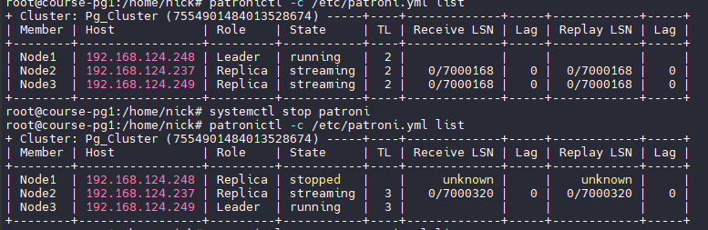

Проверяем еще раз запрос. Падает ошибка об обрыве коннекта - это нормально, ведь чудес не бывает. При смене мастера коннектры рвутся. Но повторная попытка успешна

Это был  простейший конфиг HAProxy, если надо разделить нагрузки чтения и записи, делаем так
```
listen primary
    bind *:5000
    option httpchk OPTIONS /master
    http-check expect status 200
    default-server inter 3s fall 3 rise 2 on-marked-down shutdown-sessions
    server node1 course-pg1:5432 maxconn 100 check port 8008
    server node2 course-pg2:5432 maxconn 100 check port 8008
    server node3 course-pg3:5432 maxconn 100 check port 8008

listen standbys
    balance roundrobin
    bind *:5001
    option httpchk OPTIONS /replica
    http-check expect status 200
    default-server inter 3s fall 3 rise 2 on-marked-down shutdown-sessions
    server node1 course-pg1:5432 maxconn 100 check port 8008
    server node2 course-pg2:5432 maxconn 100 check port 8008
    server node3 course-pg3:5432 maxconn 100 check port 8008
```

С таким конфигом HAProxy запрашивает статус с патрони и понимает кто мастер а кто реплика, и раскидывает трафик по нужным портам

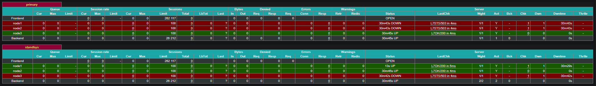

5. Дополнительно: Настройте бэкапы с использованием WAL-G или pg_probackup.

ставим wal-g по инструкции, добавляем конфиг

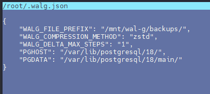

 побуем сделать бэкап и получаем ошибку как здесь при любом типе компрессии. Возможно надо использовать другие версии. По последней issue открыт и ответа нет.

https://github.com/wal-g/wal-g/issues/2044

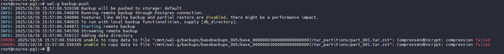