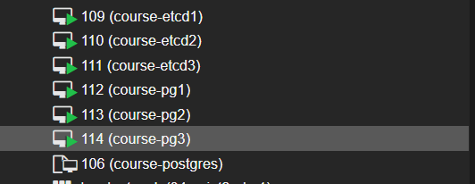

Повторите шаги Алексея:

1. Создайте 3 виртуальные машины для etcd и 3 виртуальные машины для Patroni.

Создаем из машины для ДЗ 1 шаблон, а из него 6 машин, переименовываем, меняем machine id, чтобы получить уникальные адреса по DHCP

2. Разверните HA-кластер PostgreSQL с использованием Patroni.

Ставим etcd на course-etcd1-3

Редактируем /etc/hosts чтобы использовать имена машин

Редактируем конфиги mcedit /etc/default/etcd

Запускаем etcd и смотрим статус, видим лидера

Далее будем ставить Патрони. Ставим все зависимости и сам патрони

Правим конфиги mcedit /etc/patroni.yml

Стартуем и смотрим статус

3. Настройте HAProxy для балансировки нагрузки.
4. Проверьте отказоустойчивость кластера, имитируя сбой на одном из узлов.
5. Дополнительно: Настройте бэкапы с использованием WAL-G или pg_probackup.