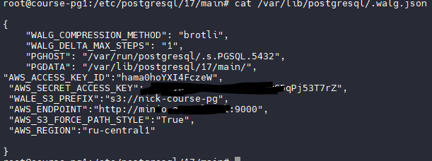

Повторите шаги Алексея:

1. Настройте бэкапы PostgreSQL с использованием WAL-G, pg_probackup или любого другого аналогичного ПО для базы данных "Лояльность оптовиков".

1.1. Откатываем кластер из прошлого занятия на 17 версию, в 18-й работа никем не гарантируется пока.

На каждой ноде.

```
apt purge postgresql-18
rm -rf  /var/lib/postgresql/18/main/*
apt install postgresql-17
```

1.2. Правим конфиги /etc/patroni.yml (пути к папкам), запускаемся, создаем таблицы и данные.


1.3. Ставим wal-g на все ноды


1.4. Будем использовать существующий сервис minio для хранения бэкапов. Создаем бакет


Добавляем юзера и ключ. На всех нодах создаем конфиг



1.5. Вносим изменения в /etc/patroni.yml


Включаем archive_mode: on

1.6. Создаем скрипт для bootstrap кластера (берем из инструкции к БД tantor, наш клон постгри с хоть сколько-то внятной документацией по бэкапу патрони)

mcedit /opt/tantor/etc/patroni/tantor-wal-g.sh


Он проверяет наличие папки с данными, наличие бэкапов и делает рестор полного бэкапа.

1.7. Делаем полный бэкап.


Убеждаемся, что нет предупреждений такого вида


Если есть, надо устранить все проблемы с архивированием WAL

2. Восстановите данные на другом кластере, чтобы убедиться, что бэкапы работают.

Смотрим список бэкапов


Останавливаем патрони, начиная с реплик (чтобы не плодить фейловеры и тайм-лайны). Удаляем и пересоздаем папки с данными на всех нодах, чтобы пересоздать кластер с нуля. Выключаем archive_mode: off, чтобы в процессе восстановления новые логи не повредили старые. 

```
sudo systemctl stop patroni
mv /var/lib/postgresql/17/ /mnt/bkp/
mkdir -p /var/lib/postgresql/17/main
chown -R  postgres:postgres /var/lib/postgresql
chmod -R 0700 /var/lib/postgresql
sed -i 's/archive_mode: '\''on'\''/archive_mode: '\''off'\''/g'  /etc/patroni.yml
```

Удаляем данные о кластере из etcd (строго обязательно, иначе никакой bootstrap не начнется!)


Стартуем, начиная с мастер-ноды. Сразу смотрим лог патрони, чтобы понять что происходит в процессе bootstrap. Должен восстановиться последний полный бэкап и WAL.
Когда мастер-нода полностью заружена, можно стартовать остальные. 
Проверяем, что весь кластер живой.


3. Проверьте, что данные восстановлены корректно.

Запускаем psql, смотрим таблицу, она на месте. Не забываем включить archive_mode: on, чтобы бэкапы опять начали работать нормально и слить новый полный бэкап.


4. Дополнительно: Снимите бэкап под нагрузкой с реплики.

Будем выполнять бэкап на реплике. 

Добавляем новые данные для проверки того, что бэкап новый

```
insert into shipments(product_name, quantity, destination) values('sugar', 999, 'Russia');
insert into shipments(product_name, quantity, destination) values('sugar', 999, 'Russia');
```


Для контроля также полностью удаляем все прошлые бэкапы из wal-g


Переходим на машину course-pg3 - это реплика.  Сливаем полный бэкап и проверяем его наличие


Журналы WAL продолжают падать с мастера! Останвливаем и удаляем кластер, как было описано выше.

```
sudo systemctl stop patroni
mv /var/lib/postgresql/17/ /mnt/bkp/
mkdir -p /var/lib/postgresql/17/main
chown -R  postgres:postgres /var/lib/postgresql
chmod -R 0700 /var/lib/postgresql
sed -i 's/archive_mode: '\''on'\''/archive_mode: '\''off'\''/g'  /etc/patroni.yml
```

Восстанавливемся на ноде course-pg1. Видим, что первая нода стартанула, данные на месте


Аналогично поднимаем две реплики. Все нормально. Таймлайн переключился с 9 на 10, это тоже норма


