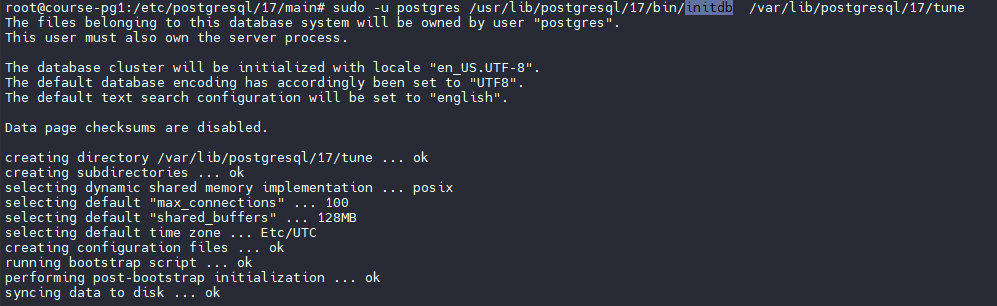
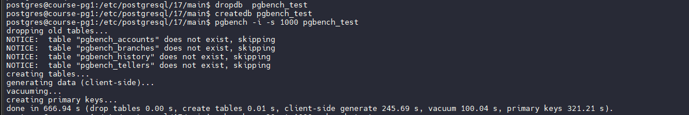
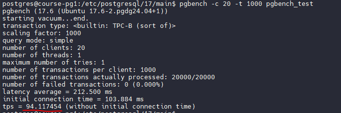
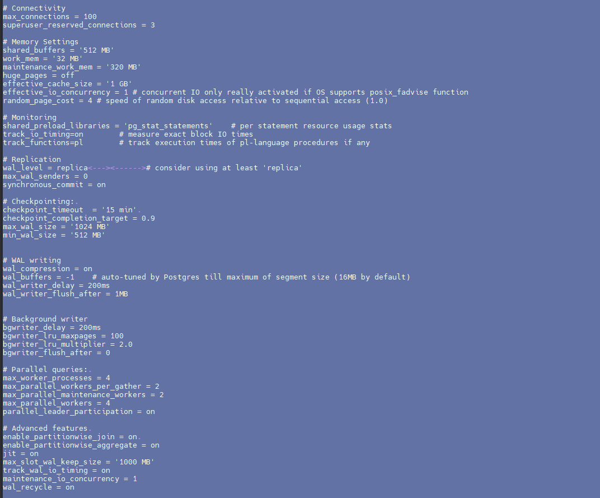
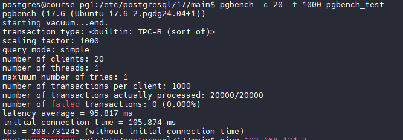
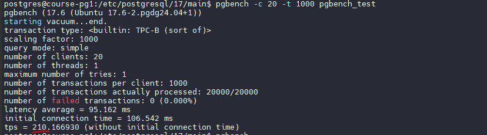

Повторите шаги Алексея:

1. Разверните инстанс PostgreSQL на виртуальной машине в Яндекс.Облаке или любом другом месте.

Будем использовать хост из ДЗ про патрони, просто создадим новую папку с данными и поправим конфиги.



2. Протестируйте производительность с помощью pgbench.

Создаем тестовую базу, используем масштабный фактор 1000, БД получится около 15Гб. Если делать меньше, толку от оптимизации практически ноль, вся база помещается в памяти.



Тестируем производительность в 20 потоков. 



Получаем 94 транзакции в секунду.

3. Оптимизируйте настройки PostgreSQL для максимальной производительности.

Изменяем настройки, опираясь на конфигурацию тестовой машины - 4 процессора, 2ГБ ОЗУ



Пока оставляем synchronous_commit = on 

Рестартуем 

```
sudo systemctl restart postgresql@17-main.service
```

4. Проверьте, насколько выросла производительность.

Проверяем, получаем 208 транзакций в секунду. Результат улучшился в 2 раза!



5. Настройте кластер на оптимальную производительность, не обращая внимания на стабильность БД.

Выключаем synchronous_commit и fsync, а также делаем wal минимальным


Перезпускаемся, проверяем и видим



210 транзакций в секунду, в пределах погрешности. Видимо, сохранение данных на диск не является узким местом в данном сценарии тестирования.

Вывод: мы научились оптимизировать производительность постгри, и поняли, что общие советы и универсальная настройка параметров не могут дать огромного эффекта. Надо оптимизировать сами запросы, что данная домашняя работа не предусматривает - мы выполняем стандартный тест. 