```
🚧 Подготовка

Установите и запустите Minikube.
Убедитесь, что у вас установлены kubectl и psql.
```

Для разнообразия поставим minikube на windows, используя драйвер Hyper-V

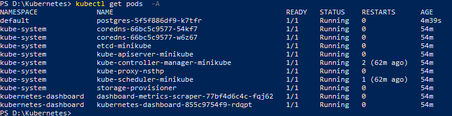

psql аналогично

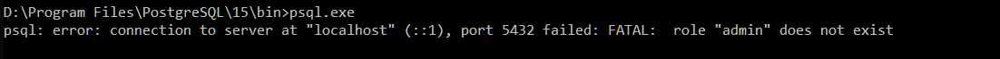

```
🔨 Основная часть


Шаг 1: Развернуть PostgreSQL через манифест

Создайте Deployment и Service для PostgreSQL.

```

Создаем deployment

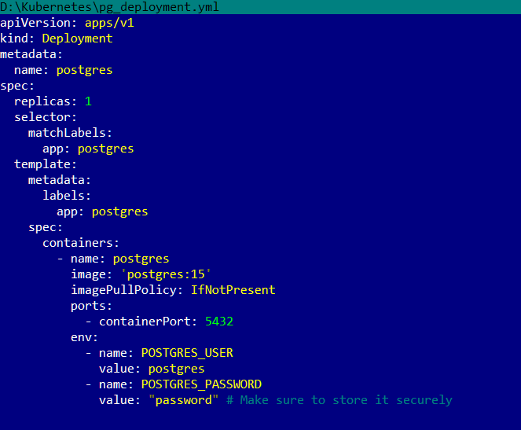

Service

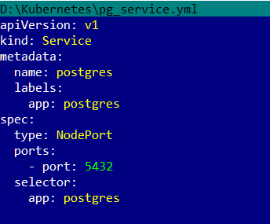

```
Укажите имя пользователя и пароль через переменные окружения в Deployment (например, POSTGRES_USER и POSTGRES_PASSWORD).
```

Применяем (применяем уже не первый раз, поэтому изменений нет):

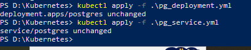

```
Убедитесь, что база данных поднимается и отвечает на подключения (kubectl port-forward + psql).
```

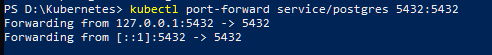

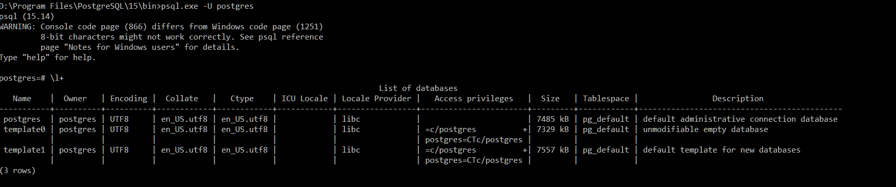

Все работает.

```
⭐ Задание повышенной сложности

Шаг 2: Развернуть PostgreSQL через Helm

Установите Helm.
```

Под Windows helm ставится, но после начинаются проблемы с тем что нет нужных команд типа base64. Поэтому второую часть работы сделаем в настоящем тестовом k8s. helm там уже есть, ставится легко, строго по инструкции 

```
Найдите и установите подходящий Helm-чарт PostgreSQL 14 (например, Bitnami PostgreSQL).
```

Пробуем ставить, оказывается что Россия как обычно забанена, прописываем прокси и исключения для него.

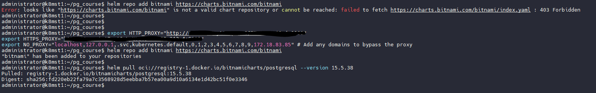

```
Укажите параметры подключения в values.yaml.

Обеспечьте масштабируемость: задайте replicaCount: 3 или используйте StatefulSet, если уверены.
```

Вписываем нужный storageClass, чтобы установленный ранее авто провижионер выдал нам нужные PV
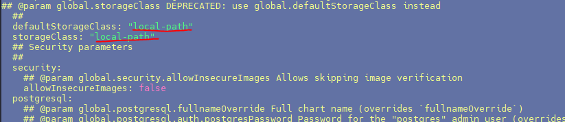

Меняем архитектуру на replication

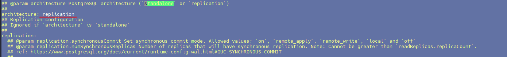

правим количество реплик

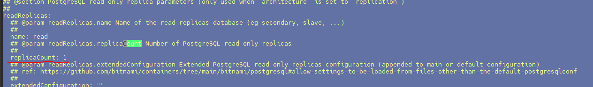

Запускаем helm install

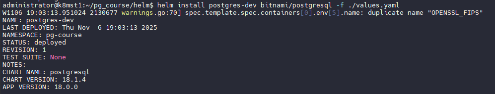

Получаем список подов, все работает.

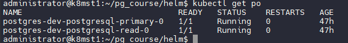

Пробрасываем порт

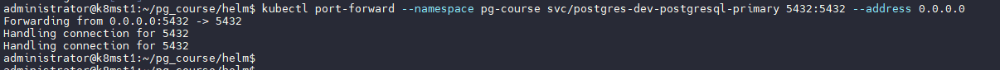

Проверяем коннект psql

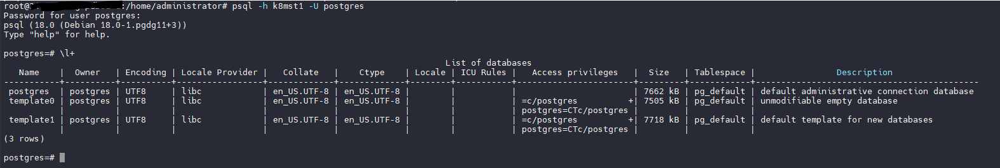

```
🔥 Кризисный момент

12:30 — Новое сообщение из Австралии:

"Циклон усиливается! Нужно перебросить запасы в Сидней до 15:00!"

Алексей: "Масштабируемся!"

Увеличьте количество подов до 3
Убедитесь, что все поды находятся в статусе Running
```

Редактируем еще раз values.yml

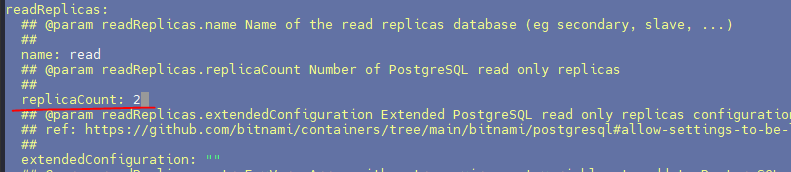

Апгрейдим helm

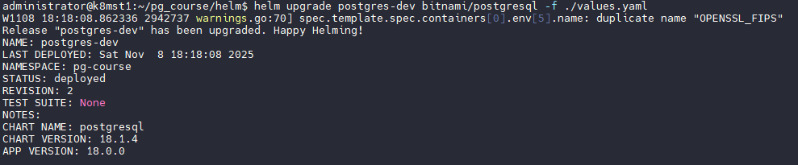

Видим как поднимается еще одна реплика

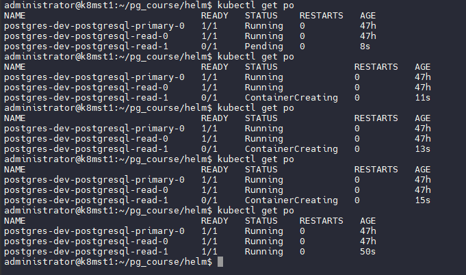

Форвардим на этот раз service для реплик

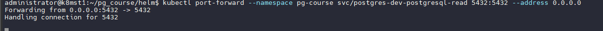

Все работает со стороны клиента. Брыв соединения т.к. мы переключили порт.

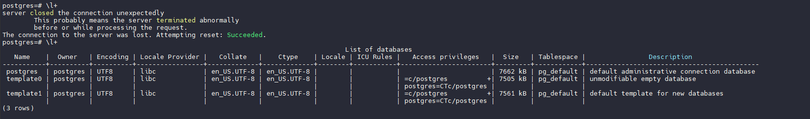

Выводы: Мы научились управылять k8s как напрямую через kubectl так и через helm, посмотрели ка кможно быстро поднять готовый кластер, и как много настроек он имеет