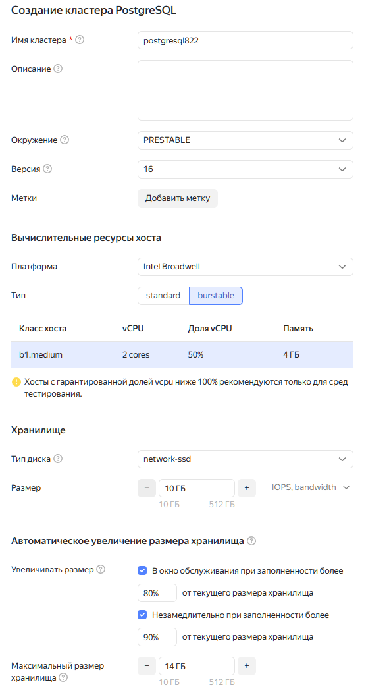
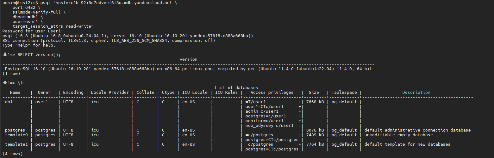
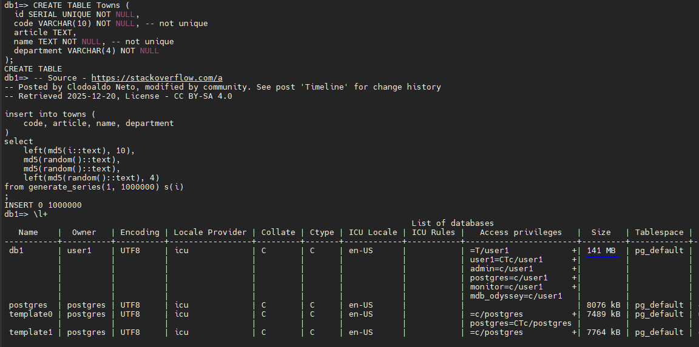
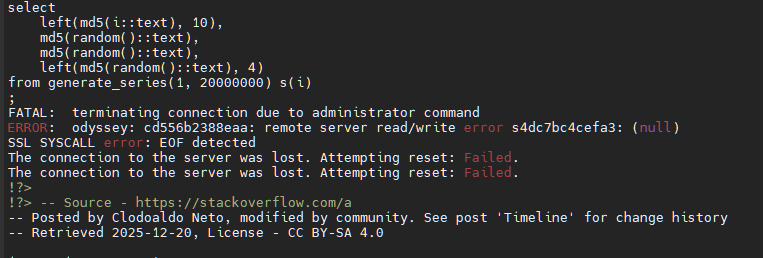
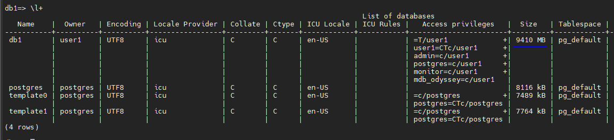
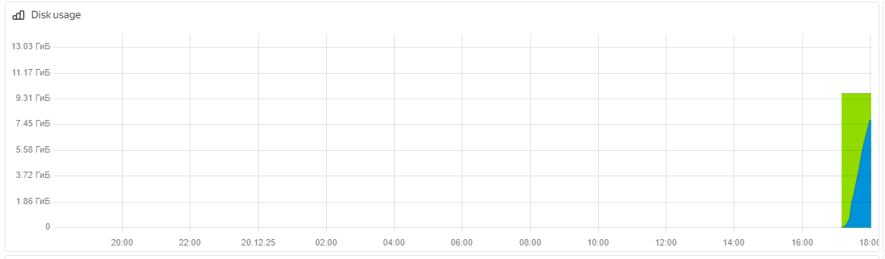
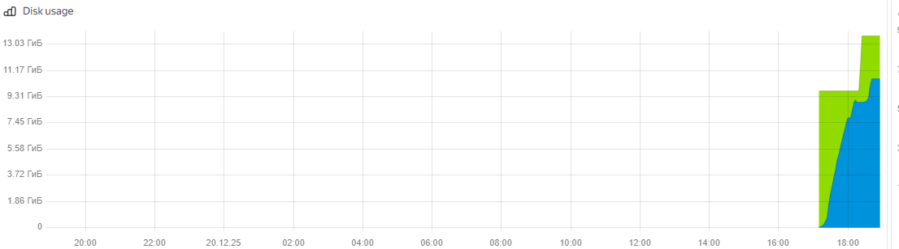

Задание: Развернуть Managed PostgreSQL в Yandex Cloud

1.Создать кластер
Ресурсы: 1 vCPU, 1 ГБ RAM

Таких параметров нет в доступе, выбираем другие минимальные. Разрешаем авто-ресайз хранилища.

2. Разрешить доступ с вашего IP

Выбираем дефолтную группу, в ней доступ из ЯО разрешен.

3. Подключиться через psql
Проверить работоспособность кластера

Подключаемся с использованием данных из консоли, проверяем, доступ есть.

Задокументировать шаги
Параметры кластера
Команда подключения
Пример выполненного запроса

🗂Формат сдачи:

Репозиторий на GitHub с README.md

⭐ Задание повышенной сложности

Автомасштабирование: Настроить auto-scaling для обработки пиковых нагрузок

Создаем большую таблицу и заполняем рандомными данными пока диск не заполнится:

В определенный момент коннект обрывается и сервер делает ресайз

Потом добавляем еще данных. Итог:

Данные из облака по размеру диска:

До масштабирования

После масштабирования:

Видим, что диск сам отмасштабировался в разрешенных нами пределах. Однако это происходит с прерыванием соединений, чего и следовало ожидать.