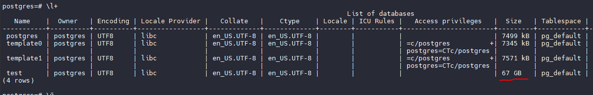

```
1. Выбрать одну из СУБД

— Это может быть ClickHouse, Greenplum, MongoDB, MySQL, Tarantool — что угодно, что установишь и сможешь сравнить с PostgreSQL.
```

Будем сравнивать с ClickHouse на своих мощностях. Машины берем из 4 работы, увеличив жесткий диск до 200Гб, чтобы поместились и файлы и БД.

```
— Убедись, что обе системы работают локально или в кластере (если хочешь — в Minikube).
```

На первой машине:

Стопим патрони, удаляем старые папки с данными, ставим postgresql-17

```
sudo apt-get update -y
sudo apt-get install -y postgresql-common -y
sudo /usr/share/postgresql-common/pgdg/apt.postgresql.org.sh -y

sudo apt-get update -y
sudo apt-get install -y postgresql-17
```

Настраиваем .conf, рестартим.  Качаем и распаковываем тестовый набор данных, который предлагает кликхаус

```
sudo systemctl restart postgresql@17-main

sudo apt-get install -y pigz
wget --continue --progress=dot:giga 'https://datasets.clickhouse.com/hits_compatible/hits.tsv.gz'
pigz -d -f hits.tsv.gz

ls -la ./hits.tsv
-rw-r--r-- 1 root root 74807831229 Jun 25  2022 ./hits.tsv

```

Создаем таблицу:

```
CREATE TABLE hits
(
    WatchID BIGINT NOT NULL,
    JavaEnable SMALLINT NOT NULL,
    Title TEXT NOT NULL,
    GoodEvent SMALLINT NOT NULL,
    EventTime TIMESTAMP NOT NULL,
    EventDate Date NOT NULL,
    CounterID INTEGER NOT NULL,
    ClientIP INTEGER NOT NULL,
    RegionID INTEGER NOT NULL,
    UserID BIGINT NOT NULL,
    CounterClass SMALLINT NOT NULL,
    OS SMALLINT NOT NULL,
    UserAgent SMALLINT NOT NULL,
    URL TEXT NOT NULL,
    Referer TEXT NOT NULL,
    IsRefresh SMALLINT NOT NULL,
    RefererCategoryID SMALLINT NOT NULL,
    RefererRegionID INTEGER NOT NULL,
    URLCategoryID SMALLINT NOT NULL,
    URLRegionID INTEGER NOT NULL,
    ResolutionWidth SMALLINT NOT NULL,
    ResolutionHeight SMALLINT NOT NULL,
    ResolutionDepth SMALLINT NOT NULL,
    FlashMajor SMALLINT NOT NULL,
    FlashMinor SMALLINT NOT NULL,
    FlashMinor2 TEXT NOT NULL,
    NetMajor SMALLINT NOT NULL,
    NetMinor SMALLINT NOT NULL,
    UserAgentMajor SMALLINT NOT NULL,
    UserAgentMinor VARCHAR(255) NOT NULL,
    CookieEnable SMALLINT NOT NULL,
    JavascriptEnable SMALLINT NOT NULL,
    IsMobile SMALLINT NOT NULL,
    MobilePhone SMALLINT NOT NULL,
    MobilePhoneModel TEXT NOT NULL,
    Params TEXT NOT NULL,
    IPNetworkID INTEGER NOT NULL,
    TraficSourceID SMALLINT NOT NULL,
    SearchEngineID SMALLINT NOT NULL,
    SearchPhrase TEXT NOT NULL,
    AdvEngineID SMALLINT NOT NULL,
    IsArtifical SMALLINT NOT NULL,
    WindowClientWidth SMALLINT NOT NULL,
    WindowClientHeight SMALLINT NOT NULL,
    ClientTimeZone SMALLINT NOT NULL,
    ClientEventTime TIMESTAMP NOT NULL,
    SilverlightVersion1 SMALLINT NOT NULL,
    SilverlightVersion2 SMALLINT NOT NULL,
    SilverlightVersion3 INTEGER NOT NULL,
    SilverlightVersion4 SMALLINT NOT NULL,
    PageCharset TEXT NOT NULL,
    CodeVersion INTEGER NOT NULL,
    IsLink SMALLINT NOT NULL,
    IsDownload SMALLINT NOT NULL,
    IsNotBounce SMALLINT NOT NULL,
    FUniqID BIGINT NOT NULL,
    OriginalURL TEXT NOT NULL,
    HID INTEGER NOT NULL,
    IsOldCounter SMALLINT NOT NULL,
    IsEvent SMALLINT NOT NULL,
    IsParameter SMALLINT NOT NULL,
    DontCountHits SMALLINT NOT NULL,
    WithHash SMALLINT NOT NULL,
    HitColor CHAR NOT NULL,
    LocalEventTime TIMESTAMP NOT NULL,
    Age SMALLINT NOT NULL,
    Sex SMALLINT NOT NULL,
    Income SMALLINT NOT NULL,
    Interests SMALLINT NOT NULL,
    Robotness SMALLINT NOT NULL,
    RemoteIP INTEGER NOT NULL,
    WindowName INTEGER NOT NULL,
    OpenerName INTEGER NOT NULL,
    HistoryLength SMALLINT NOT NULL,
    BrowserLanguage TEXT NOT NULL,
    BrowserCountry TEXT NOT NULL,
    SocialNetwork TEXT NOT NULL,
    SocialAction TEXT NOT NULL,
    HTTPError SMALLINT NOT NULL,
    SendTiming INTEGER NOT NULL,
    DNSTiming INTEGER NOT NULL,
    ConnectTiming INTEGER NOT NULL,
    ResponseStartTiming INTEGER NOT NULL,
    ResponseEndTiming INTEGER NOT NULL,
    FetchTiming INTEGER NOT NULL,
    SocialSourceNetworkID SMALLINT NOT NULL,
    SocialSourcePage TEXT NOT NULL,
    ParamPrice BIGINT NOT NULL,
    ParamOrderID TEXT NOT NULL,
    ParamCurrency TEXT NOT NULL,
    ParamCurrencyID SMALLINT NOT NULL,
    OpenstatServiceName TEXT NOT NULL,
    OpenstatCampaignID TEXT NOT NULL,
    OpenstatAdID TEXT NOT NULL,
    OpenstatSourceID TEXT NOT NULL,
    UTMSource TEXT NOT NULL,
    UTMMedium TEXT NOT NULL,
    UTMCampaign TEXT NOT NULL,
    UTMContent TEXT NOT NULL,
    UTMTerm TEXT NOT NULL,
    FromTag TEXT NOT NULL,
    HasGCLID SMALLINT NOT NULL,
    RefererHash BIGINT NOT NULL,
    URLHash BIGINT NOT NULL,
    CLID INTEGER NOT NULL
);

```

На второй такой же машине:

Стопим патрони, стопим постгри, ставим кликхаус

```
curl https://clickhouse.com/ | sh
sudo ./clickhouse install --noninteractive
sudo clickhouse start
```

Проверяем, что он запустился

```
clickhouse-client --query "SELECT 1"
1

```

Создаем таблицу такого же вида:


```
CREATE OR REPLACE TABLE hits
(
    WatchID BIGINT NOT NULL,
    JavaEnable SMALLINT NOT NULL,
    Title TEXT NOT NULL,
    GoodEvent SMALLINT NOT NULL,
    EventTime TIMESTAMP NOT NULL,
    EventDate Date NOT NULL,
    CounterID INTEGER NOT NULL,
    ClientIP INTEGER NOT NULL,
    RegionID INTEGER NOT NULL,
    UserID BIGINT NOT NULL,
    CounterClass SMALLINT NOT NULL,
    OS SMALLINT NOT NULL,
    UserAgent SMALLINT NOT NULL,
    URL TEXT NOT NULL,
    Referer TEXT NOT NULL,
    IsRefresh SMALLINT NOT NULL,
    RefererCategoryID SMALLINT NOT NULL,
    RefererRegionID INTEGER NOT NULL,
    URLCategoryID SMALLINT NOT NULL,
    URLRegionID INTEGER NOT NULL,
    ResolutionWidth SMALLINT NOT NULL,
    ResolutionHeight SMALLINT NOT NULL,
    ResolutionDepth SMALLINT NOT NULL,
    FlashMajor SMALLINT NOT NULL,
    FlashMinor SMALLINT NOT NULL,
    FlashMinor2 TEXT NOT NULL,
    NetMajor SMALLINT NOT NULL,
    NetMinor SMALLINT NOT NULL,
    UserAgentMajor SMALLINT NOT NULL,
    UserAgentMinor VARCHAR(255) NOT NULL,
    CookieEnable SMALLINT NOT NULL,
    JavascriptEnable SMALLINT NOT NULL,
    IsMobile SMALLINT NOT NULL,
    MobilePhone SMALLINT NOT NULL,
    MobilePhoneModel TEXT NOT NULL,
    Params TEXT NOT NULL,
    IPNetworkID INTEGER NOT NULL,
    TraficSourceID SMALLINT NOT NULL,
    SearchEngineID SMALLINT NOT NULL,
    SearchPhrase TEXT NOT NULL,
    AdvEngineID SMALLINT NOT NULL,
    IsArtifical SMALLINT NOT NULL,
    WindowClientWidth SMALLINT NOT NULL,
    WindowClientHeight SMALLINT NOT NULL,
    ClientTimeZone SMALLINT NOT NULL,
    ClientEventTime TIMESTAMP NOT NULL,
    SilverlightVersion1 SMALLINT NOT NULL,
    SilverlightVersion2 SMALLINT NOT NULL,
    SilverlightVersion3 INTEGER NOT NULL,
    SilverlightVersion4 SMALLINT NOT NULL,
    PageCharset TEXT NOT NULL,
    CodeVersion INTEGER NOT NULL,
    IsLink SMALLINT NOT NULL,
    IsDownload SMALLINT NOT NULL,
    IsNotBounce SMALLINT NOT NULL,
    FUniqID BIGINT NOT NULL,
    OriginalURL TEXT NOT NULL,
    HID INTEGER NOT NULL,
    IsOldCounter SMALLINT NOT NULL,
    IsEvent SMALLINT NOT NULL,
    IsParameter SMALLINT NOT NULL,
    DontCountHits SMALLINT NOT NULL,
    WithHash SMALLINT NOT NULL,
    HitColor CHAR NOT NULL,
    LocalEventTime TIMESTAMP NOT NULL,
    Age SMALLINT NOT NULL,
    Sex SMALLINT NOT NULL,
    Income SMALLINT NOT NULL,
    Interests SMALLINT NOT NULL,
    Robotness SMALLINT NOT NULL,
    RemoteIP INTEGER NOT NULL,
    WindowName INTEGER NOT NULL,
    OpenerName INTEGER NOT NULL,
    HistoryLength SMALLINT NOT NULL,
    BrowserLanguage TEXT NOT NULL,
    BrowserCountry TEXT NOT NULL,
    SocialNetwork TEXT NOT NULL,
    SocialAction TEXT NOT NULL,
    HTTPError SMALLINT NOT NULL,
    SendTiming INTEGER NOT NULL,
    DNSTiming INTEGER NOT NULL,
    ConnectTiming INTEGER NOT NULL,
    ResponseStartTiming INTEGER NOT NULL,
    ResponseEndTiming INTEGER NOT NULL,
    FetchTiming INTEGER NOT NULL,
    SocialSourceNetworkID SMALLINT NOT NULL,
    SocialSourcePage TEXT NOT NULL,
    ParamPrice BIGINT NOT NULL,
    ParamOrderID TEXT NOT NULL,
    ParamCurrency TEXT NOT NULL,
    ParamCurrencyID SMALLINT NOT NULL,
    OpenstatServiceName TEXT NOT NULL,
    OpenstatCampaignID TEXT NOT NULL,
    OpenstatAdID TEXT NOT NULL,
    OpenstatSourceID TEXT NOT NULL,
    UTMSource TEXT NOT NULL,
    UTMMedium TEXT NOT NULL,
    UTMCampaign TEXT NOT NULL,
    UTMContent TEXT NOT NULL,
    UTMTerm TEXT NOT NULL,
    FromTag TEXT NOT NULL,
    HasGCLID SMALLINT NOT NULL,
    RefererHash BIGINT NOT NULL,
    URLHash BIGINT NOT NULL,
    CLID INTEGER NOT NULL,
    PRIMARY KEY (CounterID, EventDate, UserID, EventTime, WatchID)
)
ENGINE = MergeTree;

```

```
2. Загрузить в неё данные

— Объём данных: от 10 до 100 Гб (можно взять демо-наборы или сгенерировать их самостоятельно).
```

На первой машине с постгри:

Выше получили файл размером 75Гб, нам хватит.

Далее загружаем данные

```
set -eu

# Load data: wrap TRUNCATE and \copy FREEZE in a single transaction
# If we dont' do this, Postgres will throw an error:
#     "ERROR: cannot perform COPY FREEZE because the table was not created or truncated in the current subtransaction"
# (i.e. Postgres requires that the table be either created or truncated in the current subtransaction)
sudo -u postgres psql test <<'EOF'
BEGIN;
TRUNCATE TABLE hits;
\copy hits FROM 'hits.tsv' with freeze;
COMMIT;
EOF

sudo -u postgres psql test -t -c 'VACUUM ANALYZE hits'

Load time: 2855.77
```




На второй машине с кликом:

Грузим данные чуть иначе:

```
seq 0 99 | xargs -P100 -I{} bash -c 'wget --continue --progress=dot:giga https://datasets.clickhouse.com/hits_compatible/athena_partitioned/hits_{}.parquet'
sudo mv hits_*.parquet /var/lib/clickhouse/user_files/
sudo chown clickhouse:clickhouse /var/lib/clickhouse/user_files/hits_*.parquet

clickhouse-client --time --query "TRUNCATE TABLE hits;"

echo -n "Load time: "
clickhouse-client --time --query "INSERT INTO hits SELECT * FROM file('hits_*.parquet')" --max-insert-threads $(( $(nproc) / 4 ))

Load time: 6.347

du -sh /var/lib/clickhouse/user_files
14G     /var/lib/clickhouse/user_files

```

Видим что тот же объем данных загружен гораздо быстрее, впрочем, сравнение не совсем корректное. В клике мы грузим упакованные файлы, на лету их распаковывая. Постгри же загружает заранее распакованный файл и все упирается в медленный ввод-вывод огромных файлов


```
3. Провести сравнение

— Напиши 2–3 запроса: с фильтрацией, агрегацией и соединением.
```

Берем запросы из теста кликхауса

```
SELECT COUNT(*) FROM hits;
SELECT COUNT(*) FROM hits WHERE AdvEngineID <> 0;
SELECT SUM(AdvEngineID), COUNT(*), AVG(ResolutionWidth) FROM hits;
SELECT AVG(UserID) FROM hits;
SELECT COUNT(DISTINCT UserID) FROM hits;

```

```
— Сравни скорость выполнения на PostgreSQL и выбранной системе.
```


Результаты постгри:

```
test=# \timing on
Timing is on.
test=# SELECT COUNT(*) FROM hits;
  count
----------
 99997497
(1 row)

Time: 11997.738 ms (00:11.998)
test=# SELECT COUNT(*) FROM hits;
  count
----------
 99997497
(1 row)

Time: 3519.444 ms (00:03.519)
test=# SELECT COUNT(*) FROM hits WHERE AdvEngineID <> 0;
 count
--------
 630500
(1 row)

Time: 3205.596 ms (00:03.206)
test=# SELECT SUM(AdvEngineID), COUNT(*), AVG(ResolutionWidth) FROM hits;
   sum   |  count   |          avg
---------+----------+-----------------------
 7280088 | 99997497 | 1513.4879349030106224
(1 row)

Time: 551369.949 ms (09:11.370)
test=# SELECT AVG(UserID) FROM hits;
         avg
---------------------
 2528953029789715941
(1 row)

Time: 15087.736 ms (00:15.088)
test=# SELECT COUNT(DISTINCT UserID) FROM hits;
  count
----------
 17630976
(1 row)

Time: 18782.362 ms (00:18.782)

```

Результаты клика:

```
clickhouse-client --time --query "SELECT COUNT(*) FROM hits;"
99997497
0.030
clickhouse-client --time --query "SELECT COUNT(*) FROM hits WHERE AdvEngineID <> 0;"
630500
0.209
clickhouse-client --time --query "SELECT SUM(AdvEngineID), COUNT(*), AVG(ResolutionWidth) FROM hits;"
7280088 99997497        1513.4879349030107
0.543
clickhouse-client --time --query "SELECT AVG(UserID) FROM hits;"
-55945124888.916016
1.588
clickhouse-client --time --query "SELECT COUNT(DISTINCT UserID) FROM hits;"
17630976
1.910

```
Видим, что клик в разы быстрее.  В запросе `SELECT SUM(AdvEngineID), COUNT(*), AVG(ResolutionWidth) FROM hits;` разница достигает  1014 раз!

```
— Зафиксируй: план выполнения, время, объём данных, системные условия.
```


Планы выполнения постгри:

```
EXPLAIN SELECT COUNT(*) FROM hits;
EXPLAIN SELECT COUNT(*) FROM hits WHERE AdvEngineID <> 0;
EXPLAIN SELECT SUM(AdvEngineID), COUNT(*), AVG(ResolutionWidth) FROM hits;
EXPLAIN SELECT AVG(UserID) FROM hits;
EXPLAIN SELECT COUNT(DISTINCT UserID) FROM hits;
                                                   QUERY PLAN
----------------------------------------------------------------------------------------------------------------
 Finalize Aggregate  (cost=1362443.09..1362443.10 rows=1 width=8)
   ->  Gather  (cost=1362442.87..1362443.08 rows=2 width=8)
         Workers Planned: 2
         ->  Partial Aggregate  (cost=1361442.87..1361442.88 rows=1 width=8)
               ->  Parallel Index Only Scan using adveng on hits  (cost=0.57..1257049.70 rows=41757267 width=0)
 JIT:
   Functions: 4
   Options: Inlining true, Optimization true, Expressions true, Deforming true
(8 rows)

Time: 32.996 ms
                                                  QUERY PLAN
--------------------------------------------------------------------------------------------------------------
 Finalize Aggregate  (cost=1363104.24..1363104.25 rows=1 width=8)
   ->  Gather  (cost=1363104.03..1363104.24 rows=2 width=8)
         Workers Planned: 2
         ->  Partial Aggregate  (cost=1362104.03..1362104.04 rows=1 width=8)
               ->  Parallel Index Only Scan using adveng on hits  (cost=0.57..1361442.87 rows=264463 width=0)
                     Filter: (advengineid <> 0)
 JIT:
   Functions: 5
   Options: Inlining true, Optimization true, Expressions true, Deforming true
(9 rows)

Time: 1.358 ms
                                         QUERY PLAN
--------------------------------------------------------------------------------------------
 Finalize Aggregate  (cost=8703168.40..8703168.41 rows=1 width=48)
   ->  Gather  (cost=8703168.17..8703168.38 rows=2 width=48)
         Workers Planned: 2
         ->  Partial Aggregate  (cost=8702168.17..8702168.18 rows=1 width=48)
               ->  Parallel Seq Scan on hits  (cost=0.00..8388988.67 rows=41757267 width=4)
 JIT:
   Functions: 5
   Options: Inlining true, Optimization true, Expressions true, Deforming true
(8 rows)

Time: 2.960 ms
                                                   QUERY PLAN
----------------------------------------------------------------------------------------------------------------
 Finalize Aggregate  (cost=1543801.81..1543801.82 rows=1 width=32)
   ->  Gather  (cost=1543801.59..1543801.80 rows=2 width=32)
         Workers Planned: 2
         ->  Partial Aggregate  (cost=1542801.59..1542801.60 rows=1 width=32)
               ->  Parallel Index Only Scan using userid on hits  (cost=0.57..1438408.42 rows=41757267 width=8)
 JIT:
   Functions: 4
   Options: Inlining true, Optimization true, Expressions true, Deforming true
(8 rows)

Time: 0.926 ms
                                         QUERY PLAN
--------------------------------------------------------------------------------------------
 Aggregate  (cost=2273553.75..2273553.76 rows=1 width=8)
   ->  Index Only Scan using userid on hits  (cost=0.57..2023010.15 rows=100217440 width=8)
 JIT:
   Functions: 2
   Options: Inlining true, Optimization true, Expressions true, Deforming true
(5 rows)

Time: 0.841 ms

```

Планы выполнения кликхауса:

```
clickhouse-client --time --query "EXPLAIN SELECT COUNT(*) FROM hits;"
clickhouse-client --time --query "EXPLAIN SELECT COUNT(*) FROM hits WHERE AdvEngineID <> 0;"
clickhouse-client --time --query "EXPLAIN SELECT SUM(AdvEngineID), COUNT(*), AVG(ResolutionWidth) FROM hits;"
clickhouse-client --time --query "EXPLAIN SELECT AVG(UserID) FROM hits;"
clickhouse-client --time --query "EXPLAIN SELECT COUNT(DISTINCT UserID) FROM hits;"
Expression ((Project names + Projection))
  MergingAggregated
    Expression (Change column names)
      ReadFromPreparedSource (Optimized trivial count)
0.004
Expression ((Project names + Projection))
  Aggregating
    Expression (Before GROUP BY)
      Filter ((WHERE + Change column names to column identifiers))
        ReadFromMergeTree (default.hits)
0.010
Expression ((Project names + Projection))
  Aggregating
    Expression ((Before GROUP BY + Change column names to column identifiers))
      ReadFromMergeTree (default.hits)
0.005
Expression ((Project names + Projection))
  Aggregating
    Expression ((Before GROUP BY + Change column names to column identifiers))
      ReadFromMergeTree (default.hits)
0.005
Expression ((Project names + Projection))
  Aggregating
    Expression ((Before GROUP BY + Change column names to column identifiers))
      ReadFromMergeTree (default.hits)
0.005

```

Видим что планы запросов принципиально отличны и используют разные механизмы.

Объём данных, системные условия были практически идентичными.

```
4. Описать процесс

— Что выбирал и почему
```

Был выбран кликхаус, как один из самых перспективных механизмов для хранения записей лог-файлов и получения аналитики по ним. Для нас это очень актуально.

```
— Какие механизмы загрузки пробовал
```

Для постгри выбран механизм через мета-команду клиента psql \copy, по сути идет построчный импорт из csv файла
Для кликхауса - загрузка через `INSERT INTO hits SELECT * FROM file('hits_*.parquet')` - используется Apache Parquet — это столбцовый формат хранения данных, широко распространённый в экосистеме Hadoop.
Построчный импорт сравнивать нет смысла, он бы занял нереальное время. Кликхаус загружает быстрее, но сравнение не корректно, т.к. исходные файлы кликхауса сжаты и не нагружают диск так сильно  на чтение.

```
— С какими проблемами столкнулся
```

Импорт Parquet файлов требует большого объема оперативной памяти. Пока память виртуалок не была увеличена до 16Гб, импорт падал с ошибкой нехватки памяти. Попытки ограничить память кликхауса через переменную `SET max_memory_usage = 5000000000;` приводили к тому, что падало еще раньше. Видимо, для импорта нужен большой непрерывный фрагмент памяти.

```
— Что показалось удобным, а что — нет
```

Для postgres больше удобных клиентов и библиотек, кликхаус в этом плане пока менее удобен. Например, с FreeBSD (PFSense) логи приходится отправлять сначала на промежуточный хост с линукс по протоколу syslog, и лишь оттуда отправлять в кликхаус, никакого внятного клиента для прямой загрузки под FreeBSD найти не удалось.